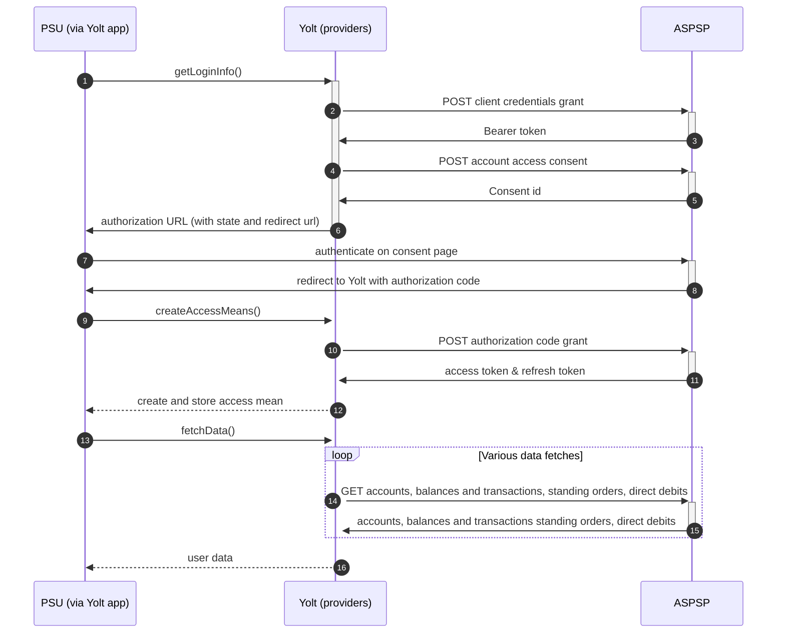

## Revolut EU (AIS)

Revolut Ltd is a British financial technology company headquartered in London, 
United Kingdom that offers banking services. It was founded in 2015.
Revolut has over 12 million customers worldwide.

## BIP overview 

|                                       |                                                                                 |
|---------------------------------------|---------------------------------------------------------------------------------|
| **Country of origin**                 | Headquarter UK / app available worldwide                                        | 
| **Site Id**                           | 555fa50d-62aa-484f-be41-399c510ff375	                                           |
| **Standard**                          | [Open Banking Standard][4]                                                      |
| **Contact**                           | E-mail: openbanking-support@revolut.com, Service Desk: api-requests@revolut.com |
| **Developer Portal**                  | [https://developer.revolut.com/portal/signin][2]                                | 
| **Documentation**                     | [https://developer.revolut.com/docs/open-banking-api/][3]                       | 
| **Account SubTypes**                  | Current, Savings                                                                |
| **IP Whitelisting**                   | No                                                                              |
| **AIS Standard version**              | v3.1.0                                                                          |
| **Auto-onboarding**                   | Yes                                                                             |
| **Requires PSU IP address**           | No                                                                              |
| **Type of certificate**               | eIDAS                                                                           |
| **Signing algorithms used**           | PS256                                                                           |
| **Mutual TLS Authentication Support** | Yes                                                                             |
| **Repository**                        | https://git.yolt.io/providers/open-banking                                      |

## Links - sandbox

|                            |                                               |
|----------------------------|-----------------------------------------------|
| **Base URL**               | https://sandbox-oba.revolut.com               | 
| **Registration Endpoint**  | https://sandbox-oba.revolut.com/register      |
| **Authorization Endpoint** | https://sandbox-oba.revolut.com/ui/index.html |
| **Token Endpoint**         | https://sandbox-oba-auth.revolut.com/token    |

## Links - production 

|                            |                                       |
|----------------------------|---------------------------------------|
| **Login domains**          | [oba.revolut.com](oba.revolut.com)    | 
| **Base URL**               | https://oba.revolut.com               | 
| **Registration Endpoint**  | https://oba.revolut.com/register      |
| **Authorization Endpoint** | https://oba.revolut.com/ui/index.html |
| **Token Endpoint**         | https://oba-auth.revolut.com/token    | 

## Client configuration overview

|                                        |                                                                 |
|----------------------------------------|-----------------------------------------------------------------|
| **Institution id**                     | OB directory financial identifier                               |
| **Signing key id**                     | eIDAS Signing key id                                            | 
| **Signing key header id**              | eIDAS Signing key id                                            | 
| **Transport key id**                   | eIDAS Transport key id                                          |
| **Transport certificate**              | eIDAS Transport certificate                                     |
| **Transport certificate subject name** | eIDAS Transport certificate subject obtained using openssl tool |
| **Client id**                          | Unique identifier received during registration process          |
| **JWKS Endpoint URL**                  | Public URL of JWKS containing transport certificate used        |
| **Organization name**                  | Organization name (shown in the UI)                             |
| **Software client name**               | Software client name (shown in the UI)                          |

## Registration details

Revolut allows to [add][5] new app with dynamic registration, [update][6] it details and [delete][7] it.
All the above is well described in theirs [documentation][3].

Important note regarding Transport certificate subject name - this authentication mean is used as a value for 
jwt claim tls_client_auth_dn in registration payload. Revolut Eu expects this value to be in specific format.
Current implementation of BouncyCastle doesn't produce correct results for eIDAS certificates therefore
we need to use following command on transport certificate to obtain it:
```shell
openssl x509 -in /path/to/your/cert.pem -inform pem -noout -subject -nameopt RFC2253
```
Result of this command is prefixed with `subject=` which needs to be removed before saving as authentication mean.
For more details please consult this section of [documentation][8]

Current implementation of auto onboarding requires cleanup. It contains hardcoded redirect urls list and custom logic
which causes deletion of already existing app on Revolut side before registering new one. 
Besides RevolutEu expects issuer claim - but they don't expect anything specyfic in it. (And RevolutEu doesn't have softwareId claim as it is set in GB)

According to this documentation: https://developer.revolut.com/docs/build-banking-apps/register-your-application-using-dcr/create-a-jwt
audience value for dynamic registration should be set to 'revolut'.

## Connection Overview

Revolut follows Open Banking 3.1.0 standard. It means that flow is similar to other banks. Due to that fact,
Open Banking DTOs are used in implementation, and code relay mostly on our generic Open Banking implementation.

The _getLoginInfo_ method is used to generate login consent for user. First of all we call _token_ endpoint to get Bearer
token. Next _account-access-consents_ endpoint is called to create consent on bank side. Received `consentId` is used to
prepare authorization URL based on _authorize_ endpoint by filling it with necessary parameters. Using this URL, user 
is redirected to login domain to fill his credentials.

In _createAccessMeans_ method `code` is used to call for token. This token will be used to authenticate user
in next calls. In response there is no `refresh_token` returned. Both consent and `access_token` are valid for 90 days. 
It means that refresh token flow is not supported and default _refreshAccessMeans_ method is overridden and is just
throwing `TokenInvalidException` to led user into re-consent flow.

As in other Open Banking banks, Revolut also allows for consent removal. It is done by generic code in _onUserSiteDelete_
method. Stored earlier `consentId` is used to perform this operation.

The most complex step is data fetching. Revolut allows to collect information about accounts balances and 
transactions. The direct debits and standing orders are not supported in Revolut hence `getDirectDebits` and 
`getStandingOrders` methods are returning empty list.

The consent window is implemented for Revolut. Due to that fact we limit max transaction fetch data time to 89 days when
endpoint is called after 5 minutes from consent step.
**Consent validity rules** are not implemented for Revolut AIS as both correct & incorrect consent pages shares same HTML code.

Important information is that this bank support pagination for transactions. It returns both `BOOKED` and
`PENDING` transactions.

As CASY's request we enabled fetching Savings Accounts for Revolut. Such an account is used by the Revolut account
holder only for the saving purposes. It doesn’t have account details nor it can be used to make transactions.

Simplified sequence diagram:



## Sandbox overview

Sandbox is described in [documentation][3] but was never actively used by us when working with this bank connection.

## User Site deletion
There's `onUserSiteDelete` method implemented by this provider, however, only in a best effort manner.

## Business and technical decisions

Refresh access means operation is not supported by Revolut, 
hence except refreshing access means user is led into re-consent flow.

Revolut's `INTERIMAVAILABLE` balance is mapped to both `Current Balance` & `Available Balance`.

It happens that we receive `null` value of `OBAccount2` field. Please find message from the Revolut explaining this case:

> This could happen with different currency accounts. In EUR pocket you can have 2 addresses, one for SWIFT and one for SEPA.
> In GBP, you can have local details (account number and sort code) and IBAN for SWIFT transfers.
> Some information may be missing from specific pocket if the account is not eligible to receive local GBP details or if the currency pocket was just created.
> It may take few hours (and for local GBP around 24 hours) for details to be generated.

Above is alreade reflected in implementation,  see `RevolutAccountMapperV2.getNotNullAccountReferences`.
  
28 JAN 2021:
- Business decision was made not to process cryptocurrency accounts. Bank tends to send such accounts in accounts list.
  We filter they out following currencies:
  ```
  Bitcoin (BTC)
  Litecoin (LTC)
  Ethereum (ETH)
  Bitcoin Cash (BCH)
  Ripple (XRP)
  Stellar Lumens (XLM)
  04 NOV 2021:
  OmiseGo (OMG)
  Origin Protocol (OGN)
  ```
  Please check C4PO-6855 for details.


27 May 2022
Problem: Yolt is sending multiple account identifiers usually two IBANs and we provide one downstream as the identifier.

- Business decision was made to provide all IBANs in bankSpecific fields and stabilize the IBAN identifiers by sorting them.

  
## External links
* [Current open problems on our end][1]
* [Developer portal][2]
* [Documentation][3]
* [Open Banking Standard][4]


[1]: <https://yolt.atlassian.net/issues/?jql=project%20%3D%20%22C4PO%22%20AND%20component%20%3D%20REVOLUT_EU%20AND%20status%20!%3D%20Done%20AND%20Resolution%20%3D%20Unresolved%20ORDER%20BY%20status>
[2]: <https://developer.revolut.com/portal/signin>
[3]: <https://developer.revolut.com/docs/open-banking-api/>
[4]: <https://standards.openbanking.org.uk/>
[5]: <https://developer.revolut.com/docs/build-banking-apps/#identification-and-authentication-identification-and-authentication-dynamic-client-registration-registration-request>
[6]: <https://developer.revolut.com/docs/build-banking-apps/#identification-and-authentication-identification-and-authentication-dynamic-client-registration-updating-a-client>
[7]: <https://developer.revolut.com/docs/build-banking-apps/#identification-and-authentication-identification-and-authentication-dynamic-client-registration-deleting-a-client>
[8]: <https://developer.revolut.com/docs/build-banking-apps/#register-your-application-using-dcr-3-create-a-jwt>
