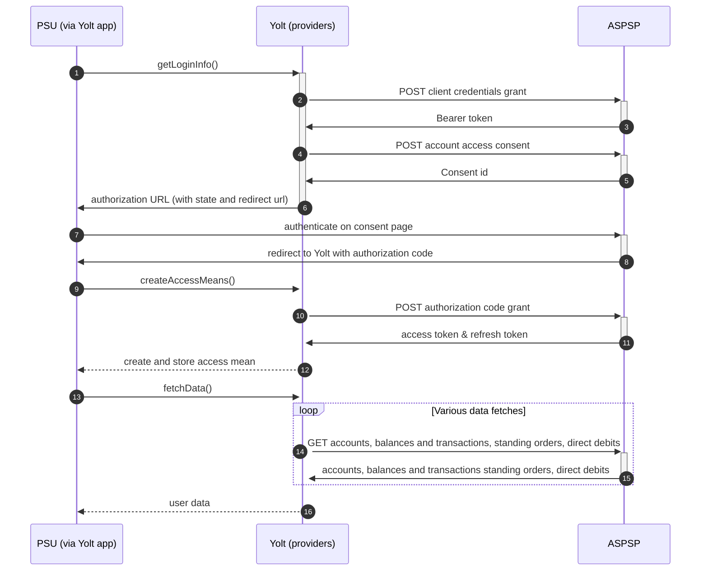

## Sainsburys (AIS)
[Current open problems on our end][1]

Sainsbury's Bank, is a British bank wholly owned by Sainsbury's, a national supermarket chain in the 
United Kingdom. The bank began trading on 19 February 1997 as a joint venture between J Sainsbury plc 
and Bank of Scotland. Sainsbury's took full ownership of the bank in January 2014.
The bank's head office is located in Edinburgh, Scotland and its registered office in London, 
England. In 2017 it had over 2.1 million active customers.

## BIP overview 

|                                       |                                                |
|---------------------------------------|------------------------------------------------|
| **Country of origin**                 | United Kingdom                                 | 
| **Site Id**                           | 2561b5e4-fa27-4d1d-ad3d-6085ffbd7aca           |
| **Standard**                          | [Open Banking Standard][2]                     |
| **Contact**                           | Service Desk: openbanking@sainsburysbank.co.uk |
| **Developer Portal**                  | https://developer.sainsburysbank.co.uk/        | 
| **Account SubTypes**                  | Credit Cards                                   |
| **IP Whitelisting**                   | No                                             |
| **AIS Standard version**              | 3.1.1                                          | 
| **Auto-onboarding**                   | Yes                                            |
| **Requires PSU IP address**           | No                                             |
| **Type of certificate**               | OBIE (OBWAC, OBSEAL) certificates required     |
| **Signing algorithms used**           | PS256                                          |
| **Mutual TLS Authentication Support** | No / Private Key Jwt used instead              |
| **Repository**                        | https://git.yolt.io/providers/open-banking     |

## Links - sandbox

|                         |                                                                                                                        |
|-------------------------|------------------------------------------------------------------------------------------------------------------------|
| **Well-known Endpoint** | https://tsob.sainsburysbank.co.uk/sso/oauth2/realms/root/realms/general/.well-known/openid-configuration (doesnt work) |

## Links - production 

|                           |                                                                                                         |
|---------------------------|---------------------------------------------------------------------------------------------------------|
| **Well-known Endpoint**   | https://iam.sainsburysbank.co.uk/sso/oauth2/realms/root/realms/general/.well-known/openid-configuration |
| **Authorization URL**     | https://iam.sainsburysbank.co.uk:443/sso/oauth2/realms/root/realms/general/authorize                    | 
| **Base URL**              | https://ob.sainsburysbank.co.uk:443/open-banking                                                        |
| **Registration Endpoint** | https://ob.sainsburysbank.co.uk:443/sso/oauth2/realms/root/realms/general/register                      |  
| **Token Endpoint**        | https://ob.sainsburysbank.co.uk:443/sso/oauth2/realms/root/realms/general/access_token                  |

## Client configuration overview

|                                  |                                                                         |
|----------------------------------|-------------------------------------------------------------------------|
| **Institution id**               | Unique identifier of the financial institution assigned by Open Banking |
| **Client id**                    | Unique identifier received during registration process                  |
| **Software id**                  | TPP's Open Banking software version                                     |  
| **Signing key header id**        | OBSEAL certificate id on OB side                                        |
| **Signing key id**               | OBSEAL certificate id on our side (HSM)                                 |
| **Transport key id**             | OBWAC certificate id on our side (HSM)                                  |
| **Transport certificate**        | OBWAC certificate                                                       |
| **Software statement assertion** | SSA required during dynamic registration - tls_client_auth method       |
| **Organization id**              | TPP's organization id                                                   |

## Registration details

Sainsbury's supports dynamic registration. Proper _/register_ endpoint is described in [documentation][4]. From call to
this endpoint we receive `clientId`, which is required to perform further fetch data flow steps. We are registered with
OB legacy certificates. Since 01.07.2021 OBWAC and OBSEAL certificates are required. OB Legacy certificates can't be
used.

## Multiple Registration

We don't know about any registration limits. There was no situation, when such knowledge was needed, so we will have to
ask about that when there will be such case.

## Connection Overview

Sainsbury's bank follows Open Banking standard. It means that flow is similar to other banks. Due to that fact,
Open Banking DTOs are used in implementation, and code relay mostly on our generic Open Banking implementation.

The _getLoginInfo_ method is used to generate login consent for user. First of all we call _token_ endpoint to get Bearer
token. Next _account-access-consents_ endpoint is called to create consent on bank side. Received `consentId` is used to
prepare authorization URL based on _authorize_ endpoint by filling it with necessary parameters. Using this URL, user 
is redirected to login domain to fill his credentials.

In _createAccessMeans_ method `code` is tused to call for token. This token will be used to authenticate user
in next calls. In response there is no `refresh_token` returned, because banks don't support this grant type. Consent 
and access token are valid for 90 days. It means that _refreshAccessMeans_ method returns `TokenInvalidException` to force
users to perform relogin when connection is expired.

As in other Open Banking banks, Sainsbury's also allows for consent removal. It is done by generic code in 
_onUserSiteDelete_ method. Stored earlier `consentId` is used to perform this operation.

The most complex step is data fetching. Sainsbury's Group allows to collect information only about accounts, balances and 
transactions. No support for standing orders or direct debits is provided.

There is no consent window implemented in Sainsbury's bank.
**Consent validity rules** are implemented for Sainsbury's bank AIS. 

Important information is that this bank support pagination for transactions. It returns both `BOOKED` and
`PENDING` transactions.

Simplified sequence diagram:

   
## Sandbox overview

Sandbox is not in use during live-maintenance phase.
In docs bank claims that to use sandbox you have to perform similar dynamic 
registration as for production environment. Sandbox contains mock data for the purpose 
of testing API connectivity. The Sandbox interface and authentication flows are created 
to represent the production environment to allow users to progress the development and 
testing of application.

## User Site deletion
There's `onUserSiteDelete` method implemented by this provider, however, only in a best effort manner.

## Business and technical decisions

During implementation we made following business decisions:

Sainsbury's `INTERIMCLEARED` balance is mapped to `Available Balance For Credit Card`, 
`INTERIMCLEARED` is mapped to `Current Balance For Credit Card`.
It happens that refresh token isn't received on refresh calls. Old one should be used then.
When generating user request token additional `max_age` of value `1 day` claim need to be added to
default generic claims set.
  
## External links
* [Current open problems on our end][1]
* [Open Banking Standard][2]
* [Sainsbury's Developer portal][3]
* [Sainsbury's API documentation][4]

[1]: <https://yolt.atlassian.net/issues/?jql=project%20%3D%20%22C4PO%22%20AND%20component%20%3D%20SAINSBURYS_BANK%20AND%20status%20!%3D%20Done%20AND%20Resolution%20%3D%20Unresolved%20ORDER%20BY%20status>
[2]: <https://standards.openbanking.org.uk/>
[3]: <https://developer.sainsburysbank.co.uk/>
[4]: <https://developer.sainsburysbank.co.uk/api>
