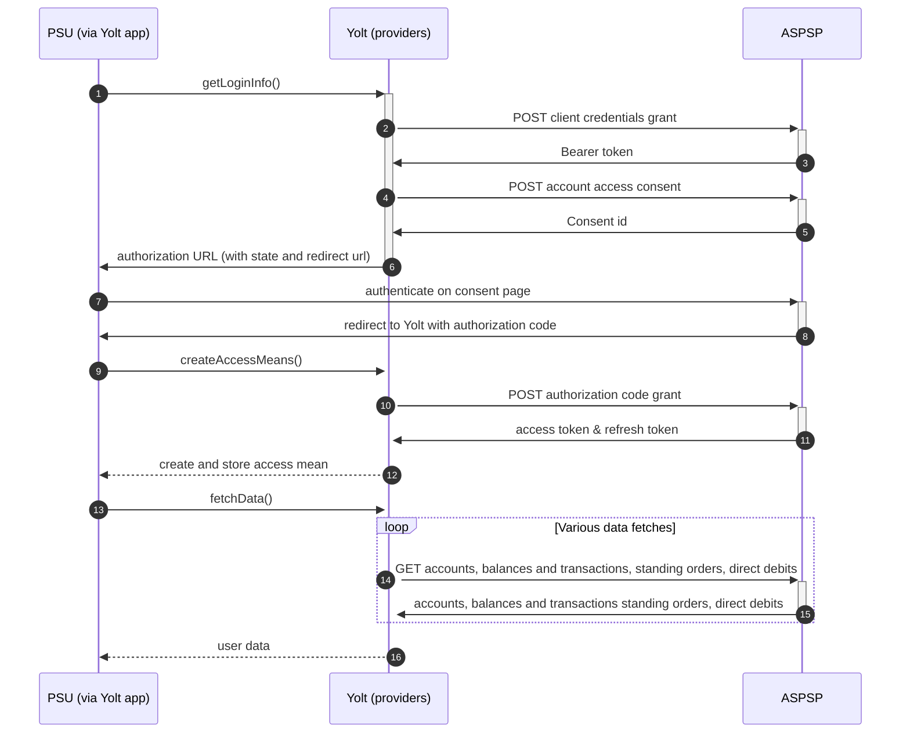

# Santander (AIS)
[Current open problems on our end][1]

Santander UK plc is a British bank, wholly owned by the Spanish Santander Group. Santander UK plc manages its affairs autonomously,
with its own local management team, responsible solely for its performance. Santander UK is one of the leading personal financial
services companies in the United Kingdom, and one of the largest providers of mortgages and savings in the United Kingdom.
The bank has circa 20,000 employees, 14 million active customers, with over 800 branches and 64 corporate business centres.

## BIP overview 

|                                       |                                            |
|---------------------------------------|--------------------------------------------|
| **Country of origin**                 | United Kingdom                             | 
| **Site Id**                           | 1ed6cc15-60fe-4b00-adf8-bd8e04e7804e       |
| **Standard**                          | [Open Banking Standard][2]                 |
| **Contact**                           | E-mail: openbankingAPI@santander.co.uk     |
| **Developer Portal**                  | https://developer.santander.co.uk/         | 
| **Account SubTypes**                  | Current, Savings, Credit Cards             |
| **IP Whitelisting**                   | No                                         |
| **AIS Standard version**              | 3.1.52                                     |
| **Auto-onboarding**                   | No                                         |
| **Requires PSU IP address**           | No                                         |
| **Type of certificate**               | eIDAS (QWAC, QSEAL) or OB trans / OB sign  |
| **Signing algorithms used**           | PS256                                      |
| **Mutual TLS Authentication Support** | Yes                                        |
| **Repository**                        | https://git.yolt.io/providers/open-banking |

## Links - sandbox

|                         |                                                                                                                                             |
|-------------------------|---------------------------------------------------------------------------------------------------------------------------------------------|
| **Well-known Endpoint** | https://openbanking-sandbox.santander.co.uk/sanuk/external-sandbox/open-banking/openid-connect-provider/v1/.well-known/openid-configuration |
| **Base URL**            | https://openbanking-ma-sandbox.santander.co.uk/sanuk/external-sandbox                                                                       |
| **Authorization URL**   | https://openbanking-sandbox.santander.co.uk/sanuk/external-sandbox/open-banking/openid-connect-provider/v1/oauth2/authorize                 | 
| **Token Endpoint**      | https://openbanking-ma-sandbox.santander.co.uk/sanuk/external-sandbox/open-banking/openid-connect-provider/v1/oauth2/token                  |    

## Links - production 

|                         |                                                                                                                             |
|-------------------------|-----------------------------------------------------------------------------------------------------------------------------|
| **Well-known Endpoint** | https://openbanking.santander.co.uk/sanuk/external/open-banking/openid-connect-provider/v1/.well-known/openid-configuration |
| **Base URL**            | https://openbanking-ma.santander.co.uk/sanuk/external/open-banking/v3.1/                                                    |
| **Authorization URL**   | https://openbanking.santander.co.uk/sanuk/external/open-banking/openid-connect-provider/v1/oauth2/authorize                 | 
| **Token Endpoint**      | https://openbanking-ma.santander.co.uk/sanuk/external/open-banking/openid-connect-provider/v1/oauth2/token                  |  

## Client configuration overview

|                                   |                                                                         |
|-----------------------------------|-------------------------------------------------------------------------|
| **Private signing key header id** | Open Banking signing certificate key id                                 |
| **Client id**                     | Unique identifier received during registration process                  | 
| **Signing private key id**        | Open Banking signing key id                                             |
| **Institution id**                | Unique identifier of the financial institution assigned by Open Banking |
| **Transport certificate**         | Open Banking transport certificate                                      |
| **Issuer**                        | TPP's Open Banking software version (the same as Software id)           |
| **Transport private key id**      | OB transport key id                                                     |

## Registration details

Santander bank does not support dynamic registration hence no autoonboarding was implemented.
In order to register new app in Santander one need to login to theirs [developer portal][2] using Open Banking credentials
an fill-in the web form in theirs GUI. The confirmation email will be sent to the user which initiated app creation and the 
app will be in "approval pending" status. After approval app will become available.

The app can be subscribed to services like `open-banking`, `open-banking-account-information`, `openid-connect-provider-service-proxy`,
`openid-connect-provider-service`, `ob-payment-initiation`, `open-banking-account-information-product`. Each service subscription
has its version attached. When a new version of subscribed service become available, one need to request a subscription for this version.
This request is in "approval pending" status and e-mail with confirmation is sent to the user which triggered this action.
After request of new version subscription will be approved by bank side - an email with confirmation will be sent.

## Multiple Registration

We don't know about any registration limits. There was no situation, when such knowledge was needed, so we will have to
ask about that when there will be such case.

## Connection Overview

Santander follows Open Banking 3.1 standard. It means that flow is similar to other banks. Due to that fact,
Open Banking DTOs are used in implementation, and code relay mostly on our generic Open Banking implementation.

The _getLoginInfo_ method is used to generate login consent for user. First of all we call _token_ endpoint to get Bearer
token. Next _account-access-consents_ endpoint is called to create consent on bank side. Received `consentId` is used to
prepare authorization URL based on _authorize_ endpoint by filling it with necessary parameters. Using this URL, user 
is redirected to login domain to fill his credentials.

In _createAccessMeans_ method `code` is used to call for token. This token will be used to authenticate user
in next calls. In response there is also `refresh_token` returned, because consent is valid for 90 days, and `access_token` 
only for 5 minutes. It means that refresh token flow is supported and has to be implemented too. _refreshAccessMeans_
allows to perform this operation. For a given consent, the refresh token is the same, but we always map both tokens to
access means value. There can be a situation when refresh token is missing. Due to that fact we prepared logic to use old
one when such case occurs.

As in other Open Banking banks, Santander also allows for consent removal. It is done by generic code in _onUserSiteDelete_
method. Stored earlier `consentId` is used to perform this operation.

The most complex step is data fetching. Santander allows to collect information not only about accounts, balances and 
transactions, but also for standing orders. The most important thing is that for Credit 
Cards those additional information are not collected. For direct-debits empty list is returned by providers.

There is no consent window implemented.
**Consent validity rules** are implemented for Santander bank AIS. 

Important information is that this bank support pagination for transactions. It returns both `BOOKED` and
`PENDING` transactions.

Simplified sequence diagram:

   
## Sandbox overview

The sandbox is described in Santander's [documentation][3]. Santander's Sandbox doesn’t include a full consent journey.
For each of our Sandbox APIs there is a list of test scenarios that are available.
Open Banking Account Information Sandbox is available in version 3.1.15.

## User Site deletion
There's `onUserSiteDelete` method implemented by this provider, however, only in a best effort manner.

## Business and technical decisions

There was need to introduce custom `SantanderAccessMeans` in place of generic `AccessMeans` as the `redirectUrl` field
returned by santander does not match convention and is written all-lowercase (`redirecturl`). 

Following mapping is applied in Santander: 
`INTERIMBOOKED` is mapped to Current Balance. 
`INTERIMAVAILABLE` is mapped to Available Balance. 
`OPENINGCLEARED` is mapped for Current Balance for Credit Card. 
`FORWARDAVAILABLE` is mapped for Available Balance for Credit Card.

It was decided by Leon (_29.10.2020_) to set default `account name` to _"Santander account"_ because of missing 
`account name` and `account nickname` values in `/accounts` response.
It was decided by Michał Gancewski, after confirmation with santander's support to filter out accounts with blocked 
access to transactions: "Message":"Account, or Accounts have blocks preventing customer details being shared".

_09.11.2021_ Santander supports only `tls_client_auth` or `client_secret_post` as authentication method. 
We decided to implement `tls_client_auth`, so we are able to stop using client secret.
  
## External links
* [Current open problems on our end][1]
* [Open Banking Standard][2]

[1]: <https://yolt.atlassian.net/issues/?jql=project%20%3D%20%22C4PO%22%20AND%20component%20%3D%20SANTANDER%20AND%20status%20!%3D%20Done%20AND%20Resolution%20%3D%20Unresolved%20ORDER%20BY%20status>
[2]: <https://developer.santander.co.uk/>
[3]: <https://sandbox-developer.santander.co.uk/sanuk/external-sandbox/start>