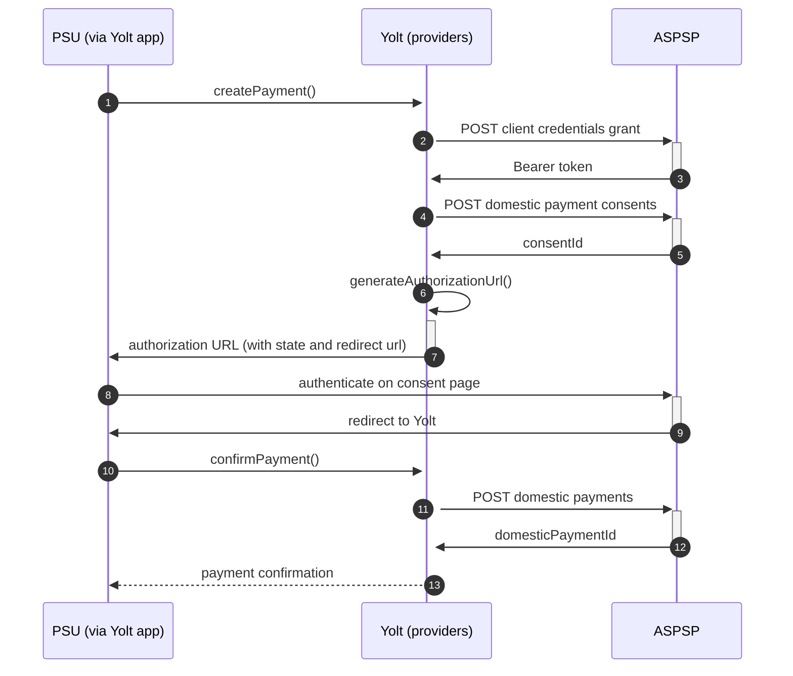

## Sandander (PIS)
[Current open problems on our end][1]

Santander UK plc is a British bank, wholly owned by the Spanish Santander Group. Santander UK plc manages its affairs autonomously,
with its own local management team, responsible solely for its performance. Santander UK is one of the leading personal financial
services companies in the United Kingdom, and one of the largest providers of mortgages and savings in the United Kingdom.
The bank has circa 20,000 employees, 14 million active customers, with over 800 branches and 64 corporate business centres.

## BIP overview 

|                                       |                                            |
|---------------------------------------|--------------------------------------------|
| **Country of origin**                 | United Kingdom                             | 
| **Site Id**                           | 1ed6cc15-60fe-4b00-adf8-bd8e04e7804e       |
| **Standard**                          | [Open Banking Standard][2]                 |
| **Contact**                           | E-mail: openbankingAPI@santander.co.uk     |
| **Developer Portal**                  | https://developer.santander.co.uk/         | 
| **Account SubTypes**                  | Current, Savings, Credit Cards             |
| **IP Whitelisting**                   | No                                         |
| **PISP Standard version**             | 3.1.19                                     |
| **Auto-onboarding**                   | No                                         |
| **Requires PSU IP address**           | No                                         |
| **Type of certificate**               | eIDAS (QWAC, QSEAL) or OB trans / OB sign  |
| **Signing algorithms used**           | PS256                                      |
| **Mutual TLS Authentication Support** | Yes                                        |
| **Repository**                        | https://git.yolt.io/providers/open-banking |

## Links - sandbox

|                       |                                                                                                                             |
|-----------------------|-----------------------------------------------------------------------------------------------------------------------------|
| **Base URL**          | https://openbanking-ma-sandbox.santander.co.uk/sanuk/external-sandbox                                                       |
| **Authorization URL** | https://openbanking-sandbox.santander.co.uk/sanuk/external-sandbox/open-banking/openid-connect-provider/v1/oauth2/authorize | 
| **Token Endpoint**    | https://openbanking-ma-sandbox.santander.co.uk/sanuk/external-sandbox/open-banking/openid-connect-provider/v1/oauth2/token  |    

## Links - production 

|                         |                                                                                                                             |
|-------------------------|-----------------------------------------------------------------------------------------------------------------------------|
| **Well-known Endpoint** | https://openbanking.santander.co.uk/sanuk/external/open-banking/openid-connect-provider/v1/.well-known/openid-configuration |
| **Base URL**            | https://openbanking-ma.santander.co.uk/sanuk/external/open-banking/v3.1/                                                    |
| **Authorization URL**   | https://openbanking.santander.co.uk/sanuk/external/open-banking/openid-connect-provider/v1/oauth2/authorize                 | 
| **Token Endpoint**      | https://openbanking-ma.santander.co.uk/sanuk/external/open-banking/openid-connect-provider/v1/oauth2/token                  |   

## Client configuration overview

|                                   |                                                                         |
|-----------------------------------|-------------------------------------------------------------------------|
| **Software id**                   | TPP's Open Banking software ID                                          |
| **Private signing key header id** | Open Banking signing certificate key id                                 |
| **Client id**                     | Unique identifier received during registration process                  | 
| **Signing private key id**        | Open Banking signing key id                                             |
| **Organization id**               | Unique identifier of the organization assigned by Open Banking          |
| **Institution id**                | Unique identifier of the financial institution assigned by Open Banking |
| **Transport certificate**         | Open Banking transport certificate                                      |
| **Issuer**                        | TPP's Open Banking software version (the same as Software id)           |
| **Transport private key id**      | OB transport key id                                                     |

## Registration details

Santander bank does not support dynamic registration hence no autoonboarding was implemented.
In order to register new app in Santander one need to login to theirs [developer portal][2] using Open Banking credentials
an fill-in the web form in theirs GUI. The confirmation email will be sent to the user which initiated app creation and the 
app will be in "approval pending" status. After approval app will become avaliable.

The app can be subscribed to services like `open-banking`, `open-banking-account-information`, `openid-connect-provider-service-proxy`,
`openid-connect-provider-service`, `ob-payment-initiation`, `open-banking-account-information-product`. Each service subscription
has its version attached. When a new version of subscribed service become available, one need to request a subscription for this version.
This request is in "approval pending" status and e-mail with confirmation is sent to the user which triggered this action.
After request of new version subscription will be approved by bank side - an email with confirmation will be sent.

## Multiple Registration

We don't know about any registration limits. There was no situation, when such knowledge was needed, so we will have to
ask about that when there will be such case.

## Connection Overview

All banks in Sandander group follows Open Banking standard. It means that flow is similar to other banks. Due to that fact,
Open Banking DTOs are used in implementation, and code relay mostly on our generic Open Banking implementation.

The _createPayment_ method is used to create payment on bank's side. Thanks that we are sure that payment data are compliant
with requirements and standards. First of all we call _token_ endpoint with `payments` scope to get required Bearer token.
Next, payment is created (as request body) based on user's data and all information is sent to the bank to create payment.
Important difference in comparison to generic OB implementation is that uppercase account scheme is not 
accepted by Santander hence need to be mapped in `getCreatePaymentRequestBody` method
with static `accountSchemeToStrMap` map in `SantanderPaymentServiceV7`. 
As a result we receive `consentId` which is required in next step.

The _generateAuthorizationUrl_ method is used to generate login consent for user. Using `consentId` authorization URL is
prepared based on _authorize_ endpoint by filling it with necessary parameters. Using this URL, user is redirected to 
login domain to fill his credentials and confirm payment.

In _confirmPayment_ method allows to confirm payment. 
Important difference in comparison to generic OB implementation is that uppercase account scheme is not 
accepted by Santander hence need to be mapped in `getConfirmPaymentRequestBody` method
with static `accountSchemeToStrMap` map in `SantanderPaymentServiceV7`.
Using the `consentId` with the same token and values at during first 
call request body is prepared. After the call, from the bank `domesticPaymentId` is returned.

Simplified sequence diagram:

**Consent validity rules**

Santander PIS consent page is an SPA, thus we are unable to determine consent validity rules for PIS.
   
## Sandbox overview

The sandbox is described in Santander's [documentation][3]. Santander's Sandbox doesn’t include a full consent journey.
For each of our Sandbox APIs there is a list of test scenarios that are available.
Open Banking Payment Initiation Sandbox is available in version 3.1.5.

## Business and technical decisions

Because Santander doesn't accept scheme name defined in OB generic enum a workaround was applied and account scheme name
is mapped with `accountSchemeToStrMap` static map defined in
`com.yolt.providers.openbanking.ais.santander.service.pis.paymentservice.SantanderPaymentServiceV7`
service in order to correct its value before using it.

_09.11.2021_ Santander supports only `tls_client_auth` or `client_secret_post` as authentication method. We decided to
implement `tls_client_auth`, so we are able to stop using client secret.

According to documentation Santander is using only AcceptedSettlementCompleted, AcceptedSettlementInProcess, Pending,
Rejected payment statuses. It was decided to map AcceptedSettlementCompleted into Completed, even that OB standard
documentation specifies AcceptedCreditSettlementCompleted as a final one.

02.03.2022 Due to agreements with yts-core it was decided that we want to treat payment as completed once money has been
deducted from debtor account. According to OB documentation `AcceptedSettlementCompleted` is proper status. For
reference see https://yolt.atlassian.net/browse/C4PO-9754

**Payment Flow Additional Information**

|                                                                                                        |                             |
|--------------------------------------------------------------------------------------------------------|-----------------------------|
| **When exactly is the payment executed ( executed-on-submit/executed-on-consent)?**                    | execute-on-submit           |
| **it is possible to initiate a payment having no debtor account**                                      | YES                         |
| **At which payment status we can be sure that the money was transferred from the debtor to creditor?** | AcceptedSettlementCompleted |

## External links
* [Current open problems on our end][1]
* [Open Banking Standard][2]

[1]: <https://yolt.atlassian.net/issues/?jql=project%20%3D%20%22C4PO%22%20AND%20component%20%3D%20SANTANDER%20AND%20status%20!%3D%20Done%20AND%20Resolution%20%3D%20Unresolved%20ORDER%20BY%20status>
[2]: <https://standards.openbanking.org.uk/>