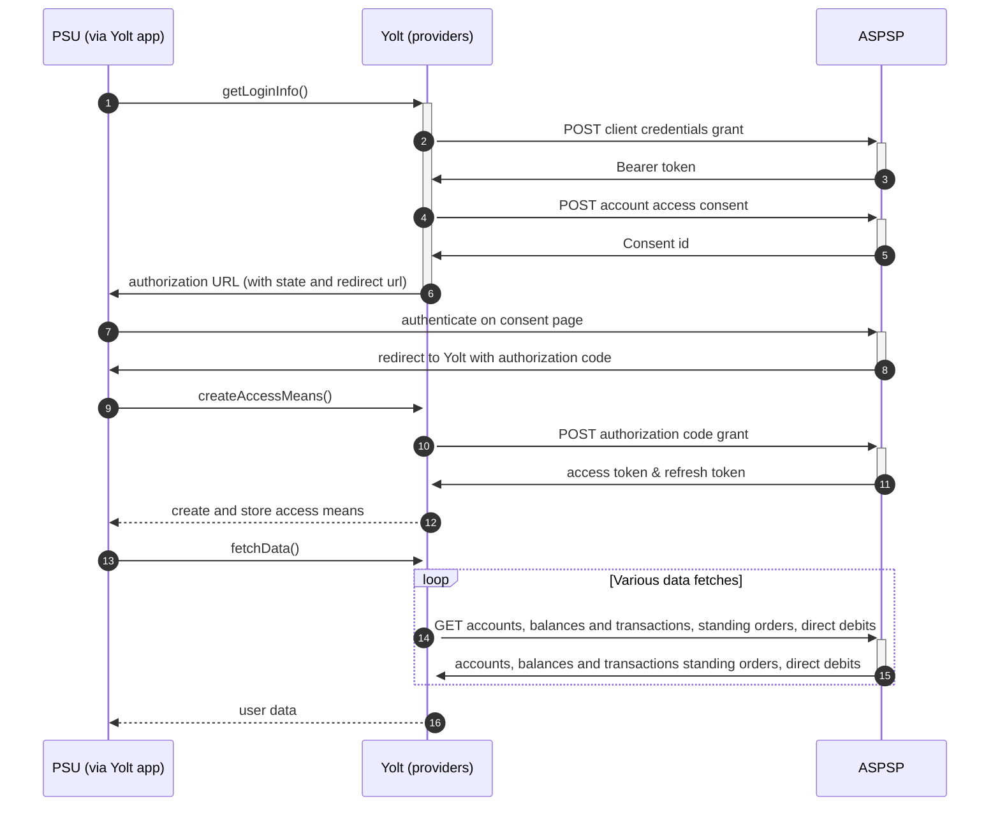

# Tesco (AIS)
[Current open problems on our end][1]

Tesco Bank is a British retail bank which was formed in July 1997 (as Tesco Personal Finance), and which has been wholly owned by Tesco plc since 2008. 
The bank was formed as part of a 50:50 joint venture between The Royal Bank of Scotland and Tesco, the largest supermarket in the United Kingdom.

## BIP overview 

|                                       |                                            |
|---------------------------------------|--------------------------------------------|
| **Country of origin**                 | United Kingdom                             | 
| **Site Id**                           | 63fbc5dd-b581-4915-9ddb-05443cbf861b       |
| **Standard**                          | [Open Banking Standard][2]                 |
| **Contact**                           | E-mail: apisupport@tescobank.com           |
| **Developer Portal**                  | https://www.tescobank.com/developer        | 
| **Account SubTypes**                  | Current, Savings, Credit Cards             |
| **IP Whitelisting**                   | No                                         |
| **AIS Standard version**              | 3.1.1                                      |
| **Auto-onboarding**                   | Yes                                        |
| **Requires PSU IP address**           | No                                         |
| **Type of certificate**               | OBIE (OBWAC, OBSEAL)                       |
| **Signing algorithms used**           | PS256                                      |
| **Mutual TLS Authentication Support** | Yes                                        |
| **Repository**                        | https://git.yolt.io/providers/open-banking |

## Links - sandbox

|                           |                                                                           |
|---------------------------|---------------------------------------------------------------------------|
| **Well-known Endpoint**   | https://identity.developer.tescobank.com/.well-known/openid-configuration |
| **Base URL**              | https://ob.api.developer.tescobank.com/open-banking                       |
| **Authorization URL**     | https://identity.developer.tescobank.com/as/authorization.oauth2          | 
| **Token Endpoint**        | https://identity.developer.tescobank.com/as/token.oauth2                  |
| **Registration Endpoint** | https://identity.developer.tescobank.com/as/clients.oauth2                |    

## Links - production 

|                           |                                                                                  |
|---------------------------|----------------------------------------------------------------------------------|
| **Well-known Endpoint**   | https://identity.tescobank.com/ext/open-banking/.well-known/openid-configuration |
| **Base URL**              | https://ob.api.developer.tescobank.com/open-banking                              |
| **Authorization URL**     | https://identity.tescobank.com/open-banking/as/authorization.oauth2              | 
| **Token Endpoint**        | https://ob.api.identity.tescobank.com/as/token.oauth2                            |
| **Registration Endpoint** | https://ob.api.identity.tescobank.com/as/clients.oauth2                          |  

## Client configuration overview

|                           |                                                        |
|---------------------------|--------------------------------------------------------|
| **Institution id**        | Unique identifier of the bank assigned by Open Banking |
| **Software id**           | TPP's Open Banking software version                    |
| **Organization id**       | YOLT id from OB directory                              | 
| **Client id**             | Unique identifier received during registration process |
| **Signing key id**        | OBSEAL key id                                          |
| **Signing key header id** | OBSEAL certificate id from Open Banking directory      |
| **Transport certificate** | OBWAC certificate                                      |
| **Transport key id**      | OBWAC key id                                           |

## Registration details

Tesco Bank requires dynamic registration to be performed before TPP will be able to use their PSD2 API. It can 
be done by calling proper _/register_ endpoint. As a result we receive `clientId`, that is required to perform further 
steps. 
All registration requirements and possible configuration are described on well-known endpoint. 
Additionally in this bank we are not subscribed to any particular API version. It means that we have access to all APIs 
versions and it depends on bank, which version is used right now. Thanks that we don't have to remember to switch when 
new version is released.

## Multiple Registration

We don't know about any registration limits. There was no situation, when such knowledge was needed, so we will have to
ask about that when there will be such case.

## Connection Overview

Tesco Bank follows Open Banking standard. It means that flow is similar to other banks. Due to that fact,
Open Banking DTOs are used in implementation, and code relay mostly on our generic Open Banking implementation.

The _getLoginInfo_ method is used to generate login consent for user. First of all we call _token_ endpoint to get Bearer
token. Next _account-access-consents_ endpoint is called to create consent on bank side. Received `consentId` is used to
prepare authorization URL based on _authorize_ endpoint by filling it with necessary parameters. Using this URL, user 
is redirected to login domain to fill his credentials.

In _createAccessMeans_ method `code` is used to call for token. This token will be used to authenticate user
in next calls. In response there is also `refresh_token` returned. Both consent and refresh token are valid for 90 days, 
but `access_token` only for 30 minutes. It means that refresh token flow is supported and has to be implemented too. 
_refreshAccessMeans_ allows to perform this operation. For a given consent, the refresh token is the same and is not
returned during refresh call, so we always map only `access_token` with old `refresh_token` to access means value. 

As in other Open Banking banks, Tesco also allows for consent removal. It is done by generic code in _onUserSiteDelete_
method. Stored earlier `consentId` is used to perform this operation.

The most complex step is data fetching. Tesco allows to collect information not only about accounts, balances and 
transactions, but also for standing orders. 

There is also 5 minute consent window implemented in generic way. 
**Consent validity rules** are implemented for Tesco bank AIS.

Important information is that this bank support pagination for transactions. It returns both `BOOKED` and
`PENDING` transactions.

Simplified sequence diagram:

   
## Sandbox overview

The Sandbox contains mock data for the purpose of testing API connectivity. The Sandbox interface and authentication 
flows are created to represent the production environment to allow users to progress the development and testing of 
application.
To use sandbox TPP has to register on their portal and perform proper registration call to get access. During implementation
we didn't use sandbox, so we don't have knowledge about it.

## User Site deletion
There's `onUserSiteDelete` method implemented by this provider, however, only in a best effort manner.

## Business and technical decisions

Parties endpoint isn't implemented by bank. Party endpoint is implemented, but generic implementation isn't ready to use
it.

According to bank's reply regarding C4PO-8925 case - Tesco Bank can return HTTP 400 Bad Request with message "Consent
does not have a status of Authorised" for users who has recently taken another product with Tesco Bank. As there is now
an additional product, a new consent will need to be set-up.

01.12.2021 Due to discontinuation of Current Account we have to implement custom exception handler for fetching accounts
endpoints. When we received HTTP 400 with "Invalid Account Status" message from GET /accounts endpoint we return
TokenInvalidException. If we received the same error from GET /account/{accountId}/transactions or GET
/account/{accountId}/balances then we skip that account and proceeded to next one.

## External links

* [Current open problems on our end][1]
* [Open Banking Standard][2]

[1]: <https://yolt.atlassian.net/issues/?jql=project%20%3D%20%22C4PO%22%20AND%20component%20%3D%20TESCO_BANK%20AND%20status%20!%3D%20Done%20AND%20Resolution%20%3D%20Unresolved%20ORDER%20BY%20status>
[2]: <https://standards.openbanking.org.uk/>