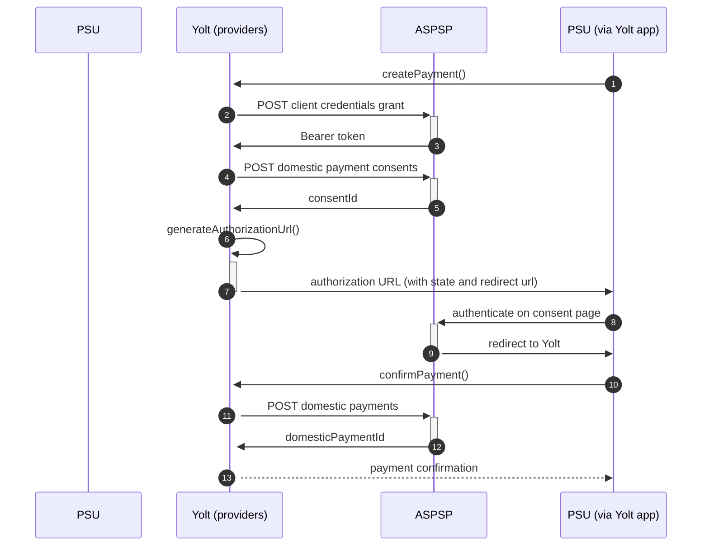

# Tesco (PIS)
[Current open problems on our end][1]

Tesco Bank is a British retail bank which was formed in July 1997 (as Tesco Personal Finance), and which has been wholly owned by Tesco plc since 2008. 
The bank was formed as part of a 50:50 joint venture between The Royal Bank of Scotland and Tesco, the largest supermarket in the United Kingdom.

## BIP overview 

|                                       |                                            |
|---------------------------------------|--------------------------------------------|
| **Country of origin**                 | United Kingdom                             | 
| **Site Id**                           | 63fbc5dd-b581-4915-9ddb-05443cbf861b       |
| **Standard**                          | [Open Banking Standard][2]                 |
| **Contact**                           | E-mail: apisupport@tescobank.com           |
| **Developer Portal**                  | https://www.tescobank.com/developer        | 
| **IP Whitelisting**                   | No                                         |
| **PIS Standard version**              | 3.1.1                                      |
| **Auto-onboarding**                   | Yes                                        |
| **Requires PSU IP address**           | No                                         |
| **Type of certificate**               | OBIE (OBWAC, OBSEAL)                       |
| **Signing algorithms used**           | PS256                                      |
| **Mutual TLS Authentication Support** | Yes                                        |
| **Repository**                        | https://git.yolt.io/providers/open-banking |

## Links - sandbox

|                           |                                                                           |
|---------------------------|---------------------------------------------------------------------------|
| **Well-known Endpoint**   | https://identity.developer.tescobank.com/.well-known/openid-configuration |
| **Base URL**              | https://ob.api.developer.tescobank.com/open-banking                       |
| **Authorization URL**     | https://identity.developer.tescobank.com/as/authorization.oauth2          | 
| **Token Endpoint**        | https://identity.developer.tescobank.com/as/token.oauth2                  |
| **Registration Endpoint** | https://identity.developer.tescobank.com/as/clients.oauth2                |    

## Links - production 

|                           |                                                                                  |
|---------------------------|----------------------------------------------------------------------------------|
| **Well-known Endpoint**   | https://identity.tescobank.com/ext/open-banking/.well-known/openid-configuration |
| **Base URL**              | https://ob.api.developer.tescobank.com/open-banking                              |
| **Authorization URL**     | https://identity.tescobank.com/open-banking/as/authorization.oauth2              | 
| **Token Endpoint**        | https://ob.api.identity.tescobank.com/as/token.oauth2                            |
| **Registration Endpoint** | https://ob.api.identity.tescobank.com/as/clients.oauth2                          |  

## Client configuration overview

|                           |                                                        |
|---------------------------|--------------------------------------------------------|
| **Institution id**        | Unique identifier of the bank assigned by Open Banking |
| **Software id**           | TPP's Open Banking software version                    |
| **Organization id**       | YOLT id from OB directory                              | 
| **Client id**             | Unique identifier received during registration process |
| **Signing key id**        | OBSEAL key id                                          |
| **Signing key header id** | OBSEAL certificate id from Open Banking directory      |
| **Transport certificate** | OBWAC certificate                                      |
| **Transport key id**      | OBWAC key id                                           |

## Registration details

Tesco Bank requires dynamic registration to be performed before TPP will be able to use their PSD2 API. It can 
be done by calling proper _/register_ endpoint. As a result we receive `clientId`, that is required to perform further 
steps. 
All registration requirements and possible configuration are described on well-known endpoint. 
Additionally in this bank we are not subscribed to any particular API version. It means that we have access to all APIs 
versions and it depends on bank, which version is used right now. Thanks that we don't have to remember to switch when 
new version is released.

## Multiple Registration

We don't know about any registration limits. There was no situation, when such knowledge was needed, so we will have to
ask about that when there will be such case.

## Connection Overview

Tesco Bank follows Open Banking standard. It means that flow is similar to other banks. Due to that fact,
Open Banking DTOs are used in implementation, and code relay mostly on our generic Open Banking implementation.

The _createPayment_ method is used to create payment on bank's side. Thanks that we are sure that payment data are compliant
with requirements and standards. First of all we call _token_ endpoint with `payments` scope to get required Bearer token.
Next, payment is created (as request body) based on user's data and all information is sent to the bank to create payment.
As a result we receive `consentId` which is required in next step.

The _generateAuthorizationUrl_ method is used to generate login consent for user. Using `consentId` authorization URL is
prepared based on _authorize_ endpoint by filling it with necessary parameters. Using this URL, user is redirected to 
login domain to fill his credentials and confirm payment.

In _confirmPayment_ method allows to confirm payment. Using the `consentId` with the same token and values at during first 
call request body is prepared. After the call, from the bank `domesticPaymentId` is returned.

Simplified sequence diagram:

**Consent validity rules**

Tesco Bank PIS consent page is an SPA, thus we are unable to determine consent validity rules. What is more it requires 
providing of real sort code & account numbers for payment request. Our current consent testing solution
does not support individual account numbers to be provided for a particular bank, so that we need to blacklist Tesco Bank PIS
from consent testing.

**Payment Flow Additional Information**

|                                                                                                        |                             |
|--------------------------------------------------------------------------------------------------------|-----------------------------|
| **When exactly is the payment executed ( executed-on-submit/executed-on-consent)?**                    | execute-on-submit           |
| **it is possible to initiate a payment having no debtor account**                                      | YES                         |
| **At which payment status we can be sure that the money was transferred from the debtor to creditor?** | AcceptedSettlementCompleted |

   
## Sandbox overview

The Sandbox contains mock data for the purpose of testing API connectivity. The Sandbox interface and authentication
flows are created to represent the production environment to allow users to progress the development and testing of
application. To use sandbox TPP has to register on their portal and perform proper registration call to get access.
During implementation we didn't use sandbox, so we don't have knowledge about it.

## Business and technical decisions

According to documentation Tesco is using only AcceptedSettlementCompleted, AcceptedSettlementInProcess, Pending,
Rejected payment statuses. It was decided to map AcceptedSettlementCompleted into Completed, even that OB standard
documentation specifies AcceptedCreditSettlementCompleted as a final one.

02.03.2022 Due to agreements with yts-core it was decided that we want to treat payment as completed once money has been
deducted from debtor account. According to OB documentation `AcceptedSettlementCompleted` is proper status. For
reference see https://yolt.atlassian.net/browse/C4PO-9754

## External links

* [Current open problems on our end][1]
* [Open Banking Standard][2]

[1]: <https://yolt.atlassian.net/issues/?jql=project%20%3D%20%22C4PO%22%20AND%20component%20%3D%20TESCO_BANK%20AND%20status%20!%3D%20Done%20AND%20Resolution%20%3D%20Unresolved%20ORDER%20BY%20status>
[2]: <https://standards.openbanking.org.uk/>