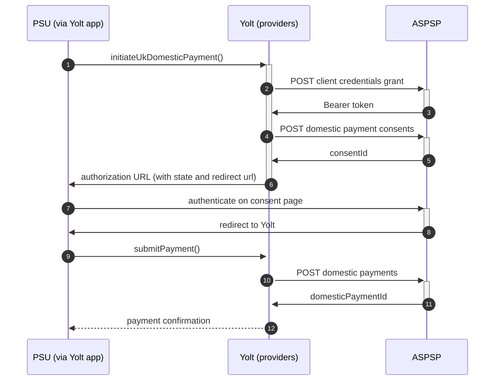

# Tide (PIS)
[Current open problems on our end][4]

Tide (Tide Platform Limited) is a UK financial technology company providing mobile-first banking services for small and medium-sized enterprises. It enables businesses to set up a current account and get instant access to various financial services (including automated bookkeeping and integrated invoicing). Established in 2015, Tide is one of the first digital-only finance platforms in the UK to provide current accounts for businesses.
 
## BIP overview 

|                                       |                                                    |
|---------------------------------------|----------------------------------------------------|
| **Country of origin**                 | United Kingdom                                     | 
| **Site Id**                           | e649db85-9e6b-46d0-8bba-d11fa816270c               |
| **Standard**                          | [Open Banking][1]                                  |
| **Contact**                           | Email: 	openbanking.support@tide.co, hello@tide.co |
| **Type of certificate**               | Open Banking (OBWAC, OBSEAL) certificates required |
| **Signing algorithms used**           | PS256                                              |
| **Mutual TLS Authentication support** | Yes                                                |
| **IP Whitelisting**                   | No                                                 |
| **Auto-onboarding**                   | Dynamic registration                               |
| **PISP Standard version**             | 3.1.2                                              |
| **Requires PSU IP address**           | no                                                 |
| **Repository**                        | https://git.yolt.io/providers/open-banking         |

## Links sandbox
|                           |                                     |
|---------------------------|-------------------------------------|
| **Sandbox base url**      | ob-api1.sandbox.tide.co:4501/v1.0   |
| **Sandbox authorization** | ob-app1.sandbox.tide.co/auth        |
| **Sandbox token**         | ob-auth1.sandbox.tide.co:4201/token |
  
## Links - development
|   |   |
|---|---|
| **Developer portal** | https://developers.tide.co

## Links - production 
|                              |                                          |
|------------------------------|------------------------------------------|
| **Production base url**      | rs1.openbanking.api.tide.co:4501/v1.0    |
| **Production authorization** | app.tide.co/links/openbanking/authorise  |
| **Production token**         | auth1.openbanking.api.tide.co:4201/token |

## Client configuration overview
|                                  |                                                         |
|----------------------------------|---------------------------------------------------------|
| **Client id**                    | Client id value received during auto onboarding process |  
| **Transport private key id**     | OBWAC private key id                                    |
| **Transport certificate**        | OBWAC certificate                                       |
| **Signing key header id**        | OBSEAL certificate id from OB directory                 |
| **Signing private key id**       | OBSEAL private key id                                   |
| **Institution id**               | Bank id from OB directory                               | 
| **Organization id**              | YOLT id from OB directory                               | 
| **Software id**                  | Id of the SSA from OB directory                         | 
| **Software Statement Assertion** | SSA needed for auto-onboarding                          |

### Registration details
Dynamic registration on url : rs1.openbanking.api.tide.co:4501/v1.0/dynamic-client-registration/v3.1/register
Scopes registered: openid accounts payments
Certificate used: OBWAC/OBSeal generated at 2020.12.22 and associated with SSA 1.1

API allows dynamic client registration in order to create a valid client that is able to use our Authorisation Server. We only trust Software Statement Assertions (SSAs) issued by the Open Banking Directory provided by OBIE. eIDAS certificates are supported via onboarding to the Open Banking Directory (as discussed in more detail below).
The url of the registration endpoint is advertised on our OIDC Discovery Endpoints (see below) using the registration_endpoint claim.
The aud claim used in the outer JWT of a Dynamic Client Registration request is the OBIE issued org_id (as documented in the OBIE DCR v3.1 standard)

Certificate Support
OB Transport & OB Signing Certificates - Tide recommends that TPPs use OB Transport and OB Signing certificates where possible. TPPs can use their QWACs and QSeals to onboard to the OBIE directory and generate these certificates.
OB WAC & OB Seal - Tide supports the use of OBWAC and OBSeal on our production and sandbox environments. TPPs can use their QWACs and QSeals to onboard to the OBIE directory and generate these certificates.
QWACs - Tide supports the use of QWACs, but this is not our recommended approach. TPPs facing issues onboarding with QWACs should contact our support desk. Please attach a pem file of the certificate to your support ticket.
QSeal - Tide supports use of QSeals that have been attached to your software statement in the OB Directory.

### Certificate rotation

## Connection Overview
Simplified sequence diagram:

### Credit/Debit transaction detection
Standard generic OB

## Business decisions

**Payment Flow Additional Information**

|                                                                                                        |                             |
|--------------------------------------------------------------------------------------------------------|-----------------------------|
| **When exactly is the payment executed ( executed-on-submit/executed-on-consent)?**                    | execute-on-submit           |
| **it is possible to initiate a payment having no debtor account**                                      | YES                         |
| **At which payment status we can be sure that the money was transferred from the debtor to creditor?** | AcceptedSettlementCompleted |

## External links
* [Open Banking Standard][1]
* [Developer Portal][2]
* [Documentation][3]
 
[1]: <https://openbanking.atlassian.net/wiki/home/>
[2]: <https://developers.tide.co/>
[3]: <https://developers.tide.co/>
[4]: <https://yolt.atlassian.net/issues/?jql=project%20%3D%20%22C4PO%22%20AND%20component%20%3D%20TIDE%20AND%20status%20!%3D%20Done%20AND%20Resolution%20%3D%20Unresolved%20ORDER%20BY%20status/>