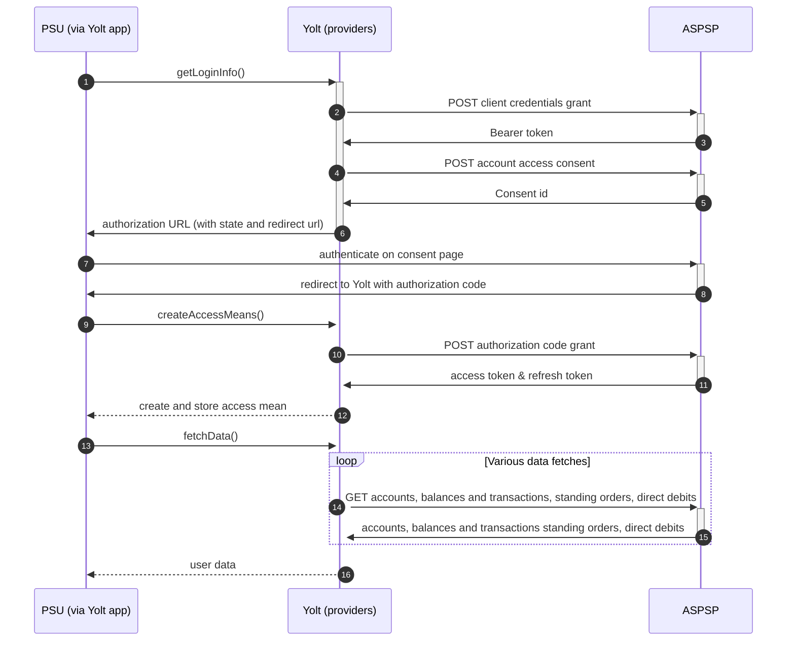

## TSB (AIS)
[Current open problems on our end][1]

TSB Bank plc is a retail and commercial bank in the United Kingdom and a subsidiary of Sabadell Group.
TSB Bank operates a network of 536 branches across England, Scotland and Wales but has not had 
a presence in Northern Ireland since 1991. TSB in its present form launched on 9 September 2013. 
Its headquarters are located in Edinburgh and it has more than 5.2 million customers

## BIP overview 

|                                       |                                                                   |
|---------------------------------------|-------------------------------------------------------------------|
| **Country of origin**                 | United Kingdom                                                    | 
| **Site Id**                           | 248cb626-55df-41c2-87bb-1242c261619a                              |
| **Standard**                          | [Open Banking Standard][2]                                        |
| **Contact**                           | Service Desk: obtppsupport@tsb.co.uk                              |
| **Developer Portal**                  | https://apis.developer.tsb.co.uk/                                 | 
| **Account SubTypes**                  | Current, Savings, Credit Cards                                    |
| **IP Whitelisting**                   | No                                                                |
| **AIS Standard version**              | 3.1                                                               |
| **Auto-onboarding**                   | Yes                                                               |
| **Requires PSU IP address**           | No                                                                |
| **Type of certificate**               | eIDAS (QWAC, QSEAL) or OBIE (OBWAC, OBSEAL) certificates required |
| **Signing algorithms used**           | PS256                                                             |
| **Mutual TLS Authentication Support** | Client Secret Post is used                                        |
| **Repository**                        | https://git.yolt.io/providers/open-banking                        |

## Links - sandbox

|                           |                                                                                        |
|---------------------------|----------------------------------------------------------------------------------------|
| **Well Known Endpoint**   | https://apis.tsb.co.uk/apis/sandbox/open-banking/v3.1/.well-known/openid-configuration |
| **Base URL**              | https://apis.tsb.co.uk/sandbox                                                         |
| **Authorization URL**     | https://apis.tsb.co.uk/apis/sandbox/open-banking/v3.1/auth/oauth2/authorize            | 
| **Token Endpoint**        | https://apis.tsb.co.uk/apis/sandbox/open-banking/v3.1/auth/oauth2/token                |
| **Registration Endpoint** | https://apis.tsb.co.uk/apis/sandbox/open-banking/v3.1/tpp/register                     |  

## Links - production 

|                           |                                                                                |
|---------------------------|--------------------------------------------------------------------------------|
| **Well Known Endpoint**   | https://apis.tsb.co.uk/apis/open-banking/v3.1/.well-known/openid-configuration |
| **Base URL**              | https://apis.tsb.co.uk/apis/open-banking                                       |
| **Authorization URL**     | https://apis.tsb.co.uk/apis/open-banking/v3.1/auth/oauth2/authorize            | 
| **Token Endpoint**        | https://apis.tsb.co.uk/apis/open-banking/v3.1/auth/oauth2/token                |
| **Registration Endpoint** | https://apis.tsb.co.uk/apis/open-banking/v3.1/tpp/register                     |  

## Client configuration overview

|                                   |                                                        |
|-----------------------------------|--------------------------------------------------------|
| **Client id**                     | Unique identifier received during registration process |
| **Client secret**                 | Unique identifier received during registration process |  
| **Institution id**                | Unique identifier of the bank assigned by Open Banking |
| **Organization id**               | TPP's organization id                                  |
| **Software id**                   | TPP's Open Banking software version                    | 
| **Private signing key header id** | Open Banking signing certificate key id                |
| **Signing key id**                | OBSEAL key id                                          |
| **Transport key id**              | OBWAC key id                                           |
| **Transport certificate**         | OBWAC certificate                                      |

## Registration details

!!!! IMPORTANT INFORMATION !!!!

We've made a decision to remove the TSB_CORPO provider as it was just a copy of TSB.
Business customers are serviced by means of a "normal" TSB. 

TSB group requires dynamic registration to be performed before TPP will be able to use their PSD2 API. It can be 
done by calling proper _/register_ endpoint. As a result we receive `clientId` and `clientSecret`, which are required 
to perform further steps. This process is implemented as auto-onboarding mechanism based on [documentation][3].

## Multiple Registration

We don't know about any registration limits. There was no situation, when such knowledge was needed, so we will have to
ask about that when there will be such case.

## Connection Overview

TSB group follows Open Banking standard. Due to that fact, Open Banking DTOs are used in implementation, and code relay 
mostly on our generic Open Banking implementation.

The _getLoginInfo_ method is used to generate login consent for user. First of all we call _token_ endpoint to get Bearer
token. Next _account-access-consents_ endpoint is called to create consent on bank side. Received `consentId` is used to
prepare authorization URL based on _authorize_ endpoint by filling it with necessary parameters. Using this URL, user 
is redirected to login domain to fill his credentials.

In _createAccessMeans_ method `code` is used to call for token. This token will be used to authenticate user
in next calls. In response there is also `refresh_token` returned, because consent is valid for 90 days, and `access_token` 
only for 5 minutes. It means that refresh token flow is supported and has to be implemented too. _refreshAccessMeans_
allows to perform this operation. For a given consent, the refresh token is the same, but we always map both tokens to
access means value.

As in other Open Banking banks, TSB group also allows for consent removal. It is done by generic code in _onUserSiteDelete_
method. Stored earlier `consentId` is used to perform this operation.

The most complex step is data fetching. TSB group allows to collect information about accounts, balances and 
transactions. We are not fetching standing orders and direct debits data as TSB is struggling 
with processing these requests. Consent window is not implemented. 
Important information is that this bank support pagination for transactions. It returns both `BOOKED` and
`PENDING` transactions.

**Consent validity rules** are implemented for TSB AIS.

Simplified sequence diagram:

   
## Sandbox overview

Sandbox is not in use during live-maintenance phase.
In docs bank claims that to use sandbox you have to perform similar dynamic 
registration as for production environment. Sandbox contains mock data for the purpose 
of testing API connectivity. The Sandbox interface and authentication flows are created 
to represent the production environment to allow users to progress the development and 
testing of application.

## User Site deletion
There's `onUserSiteDelete` method implemented by this provider, however, only in a best effort manner.

## Business and technical decisions

`INTERIMBOOKED` is mapped to Current Balance. 
`INTERIMAVAILABLE` is mapped to Available Balance and for Current Balance For Credit Card.
  
We are not using the standing orders nor direct debits as TSB is struggling with processing requests.

## External links
* [Current open problems on our end][1]
* [Open Banking Standard][2]
* [TSB documentation][3]

[1]: <https://yolt.atlassian.net/issues/?jql=project%20%3D%20%22C4PO%22%20AND%20component%20in%20(TSB_BANK)%20AND%20status%20!%3D%20Done%20AND%20Resolution%20%3D%20Unresolved%20ORDER%20BY%20status>
[2]: <https://standards.openbanking.org.uk/>
[3]: <https://apis.developer.tsb.co.uk/#/home>