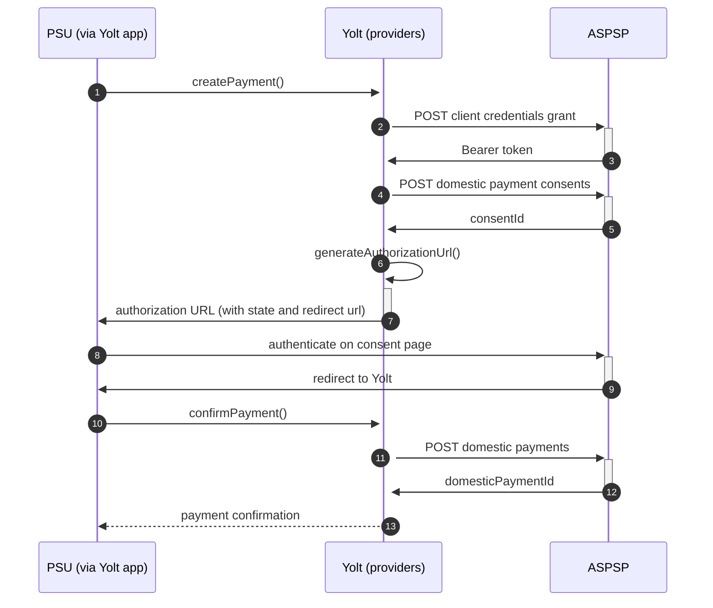

## TSB (PIS)
[Current open problems on our end][1]

TSB Bank plc is a retail and commercial bank in the United Kingdom and a subsidiary of Sabadell Group.
TSB Bank operates a network of 536 branches across England, Scotland and Wales but has not had 
a presence in Northern Ireland since 1991. TSB in its present form launched on 9 September 2013. 
Its headquarters are located in Edinburgh and it has more than 5.2 million customers

## BIP overview 

|                                       |                                                                   |
|---------------------------------------|-------------------------------------------------------------------|
| **Country of origin**                 | United Kingdom                                                    | 
| **Site Id**                           | 248cb626-55df-41c2-87bb-1242c261619a                              |
| **Standard**                          | [Open Banking Standard][2]                                        |
| **Contact**                           | Service Desk: obtppsupport@tsb.co.uk                              |
| **Developer Portal**                  | https://apis.developer.tsb.co.uk/                                 |
| **IP Whitelisting**                   | No                                                                |
| **PISP Standard version**             | 3.1                                                               |
| **Auto-onboarding**                   | Yes                                                               |
| **Requires PSU IP address**           | No                                                                |
| **Type of certificate**               | eIDAS (QWAC, QSEAL) or OBIE (OBWAC, OBSEAL) certificates required |
| **Signing algorithms used**           | PS256                                                             |
| **Mutual TLS Authentication Support** | Client Secret Post is used                                        |
| **Repository**                        | https://git.yolt.io/providers/open-banking                        |

## Links - sandbox

|                           |                                                                                        |
|---------------------------|----------------------------------------------------------------------------------------|
| **Well Known Endpoint**   | https://apis.tsb.co.uk/apis/sandbox/open-banking/v3.1/.well-known/openid-configuration |
| **Base URL**              | https://apis.tsb.co.uk/sandbox                                                         |
| **Authorization URL**     | https://apis.tsb.co.uk/apis/sandbox/open-banking/v3.1/auth/oauth2/authorize            | 
| **Token Endpoint**        | https://apis.tsb.co.uk/apis/sandbox/open-banking/v3.1/auth/oauth2/token                |
| **Registration Endpoint** | https://apis.tsb.co.uk/apis/sandbox/open-banking/v3.1/tpp/register                     |  

## Links - production 

|                           |                                                                                |
|---------------------------|--------------------------------------------------------------------------------|
| **Well Known Endpoint**   | https://apis.tsb.co.uk/apis/open-banking/v3.1/.well-known/openid-configuration |
| **Base URL**              | https://apis.tsb.co.uk/apis/open-banking                                       |
| **Authorization URL**     | https://apis.tsb.co.uk/apis/open-banking/v3.1/auth/oauth2/authorize            | 
| **Token Endpoint**        | https://apis.tsb.co.uk/apis/open-banking/v3.1/auth/oauth2/token                |
| **Registration Endpoint** | https://apis.tsb.co.uk/apis/open-banking/v3.1/tpp/register                     |  

## Client configuration overview

|                                   |                                                        |
|-----------------------------------|--------------------------------------------------------|
| **Client id**                     | Unique identifier received during registration process |
| **Client secret**                 | Unique identifier received during registration process |  
| **Institution id**                | Unique identifier of the bank assigned by Open Banking |
| **Organization id**               | TPP's organization id                                  |
| **Software id**                   | TPP's Open Banking software version                    | 
| **Private signing key header id** | Open Banking signing certificate key id                |
| **Signing key id**                | OBSEAL key id                                          |
| **Transport key id**              | OBWAC key id                                           |
| **Transport certificate**         | OBWAC certificate                                      |

## Registration details

!!!! IMPORTANT INFORMATION !!!!

We've made a decision to remove the TSB_CORPO provider as it was just a copy of TSB.
Business customers are serviced by means of a "normal" TSB. 

TSB group requires dynamic registration to be performed before TPP will be able to use their PSD2 API. It can be 
done by calling proper _/register_ endpoint. As a result we receive `clientId` and `clientSecret`, which are required 
to perform further steps. This process is implemented as auto-onboarding mechanism based on [documentation][3].

## Multiple Registration

We don't know about any registration limits. There was no situation, when such knowledge was needed, so we will have to
ask about that when there will be such case.

## Connection Overview

TSB group follows Open Banking standard. Due to that fact, Open Banking DTOs are used in implementation, and code relay 
mostly on our generic Open Banking implementation.

The _createPayment_ method is used to create payment on bank's side. Thanks that we are sure that payment data are compliant
with requirements and standards. First of all we call _token_ endpoint with `payments` scope to get required Bearer token.
Next, payment is created (as request body) based on user's data and all information is sent to the bank to create payment.
As a result we receive `consentId` which is required in next step.

The _generateAuthorizationUrl_ method is used to generate login consent for user. Using `consentId` authorization URL is
prepared based on _authorize_ endpoint by filling it with necessary parameters. Using this URL, user is redirected to 
login domain to fill his credentials and confirm payment.

In _confirmPayment_ method allows to confirm payment. Using the `consentId` with the same token and values at during first 
call request body is prepared. After the call, from the bank `domesticPaymentId` is returned.

Simplified sequence diagram:

**Consent validity rules**

TSB requires providing of real sort code & account number for payment request - our current solution does not
support providing individual numbers for a particular provider. We have to blacklist TSB from PIS consent testing.

**Payment Flow Additional Information**

|                                                                                                        |                             |
|--------------------------------------------------------------------------------------------------------|-----------------------------|
| **When exactly is the payment executed ( executed-on-submit/executed-on-consent)?d**                   | execute-on-submit           |
| **it is possible to initiate a payment having no debtor account**                                      | YES                         |
| **At which payment status we can be sure that the money was transferred from the debtor to creditor?** | AcceptedSettlementCompleted |

 
## Sandbox overview

Sandbox is not in use during live-maintenance phase.
In docs bank claims that to use sandbox you have to perform similar dynamic 
registration as for production environment. Sandbox contains mock data for the purpose 
of testing API connectivity. The Sandbox interface and authentication flows are created 
to represent the production environment to allow users to progress the development and 
testing of application.

## Business and technical decisions

During implementation we made following business decisions:

Bank requires `SortCodeAccountNumber` value to be in camel case format. We prepared mapper to convert value used in our
model to value which is compliant with documentation.

Current payment implementation uses default generic payment service, hence neither debtor information is included in the
request nor reversed remittance information is needed (regular remittance information is used).

02.03.2022 Due to agreements with yts-core it was decided that we want to treat payment as completed once money has been
deducted from debtor account. According to OB documentation `AcceptedSettlementCompleted` is proper status. For
reference see https://yolt.atlassian.net/browse/C4PO-9754

## External links

* [Current open problems on our end][1]
* [Open Banking Standard][2]
* [TSB documentation][3]

[1]: <https://yolt.atlassian.net/issues/?jql=project%20%3D%20%22C4PO%22%20AND%20component%20in%20(TSB_BANK)%20AND%20status%20!%3D%20Done%20AND%20Resolution%20%3D%20Unresolved%20ORDER%20BY%20status>

[2]: <https://standards.openbanking.org.uk/>

[3]: <https://apis.developer.tsb.co.uk/#/home>