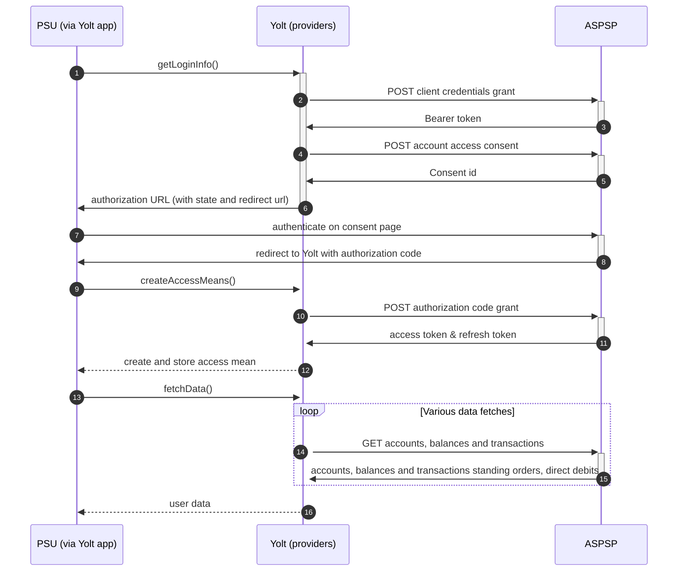

## Vanquis (AIS)
[Current open problems on our end][1]

Vanquis Bank is a subsidiary of the Provident Financial Group. Established in 2007, it offers credit building credit cards under the VISA brand for UK residents with a limited or uneven credit history. It also offers a fixed rate bond service, launched in 2011

## BIP overview 

|                                       |                                             |
|---------------------------------------|---------------------------------------------|
| **Country of origin**                 | United Kingdom                              | 
| **Site Id**                           | e43c5a0d-70c2-45ca-91d2-98a18e1d8a02        |
| **Standard**                          | [Open Banking Standard][2]                  |
| **Contact**                           | E-mail:OpenBankingSupport@vanquisbank.co.uk |
| **Developer Portal**                  | https://www.vanquis.co.uk/developer-portal  | 
| **Account SubTypes**                  | Credit Cards                                |
| **IP Whitelisting**                   | No                                          |
| **AIS Standard version**              | 3.1                                         |
| **Auto-onboarding**                   | Yes                                         |
| **Requires PSU IP address**           | No                                          |
| **Type of certificate**               | Open Banking legacy certificates required   |
| **Signing algorithms used**           | PS256                                       |
| **Mutual TLS Authentication Support** | Yes                                         |
| **Repository**                        | https://git.yolt.io/providers/open-banking  |

## Links - sandbox

|                                  |                                                                                         |
|----------------------------------|-----------------------------------------------------------------------------------------|
| **Well known endpoint**          | https://matls.as.aspsp.ob-sandbox.vanquis.co.uk/oauth2/.well-known/openid-configuration |
| **Client registration endpoint** | https://matls.as.aspsp.ob-sandbox.vanquis.co.uk/open-banking/register/                  | 
| **Base URL**                     | https://matls.rs.aspsp.ob-sandbox.vanquis.co.uk/open-banking/v3.1                       |

## Links - production 

|                                  |                                                                         |
|----------------------------------|-------------------------------------------------------------------------|
| **Well known endpoint**          | https://auth.openbanking.vanquis.co.uk/.well-known/openid-configuration |
| **Client registration endpoint** | https://mtls.auth.openbanking.vanquis.co.uk/connect/register            | 
| **Base URL**                     | https://mtls.data.openbanking.vanquis.co.uk/open-banking/v3.1/aisp      |
| **Token URL**                    | https://mtls.auth.openbanking.vanquis.co.uk/connect/token               |
| **Authorize URL**                | https://auth.openbanking.vanquis.co.uk/connect/authorize                |

## Client configuration overview

|                                   |                                                                         |
|-----------------------------------|-------------------------------------------------------------------------|
| **Client id**                     | Unique identifier received during registration process                  | 
| **Institution id**                | Unique identifier of the financial institution assigned by Open Banking |
| **Software Statement Assertion**  | TPP's Open Banking Software Statement Assertion                         |
| **Software id**                   | TPP's Open Banking software version                                     |
| **Private signing key header id** | OB certificate signing key header id                                    |
| **Signing key id**                | OB certificate signing key id                                           |
| **Transport key id**              | OB certificate transport key id                                         |
| **Transport certificate**         | OB certificate transport certificate                                    |

## Registration details

Vanquis requires dynamic registration to be performed. It can be done
by calling proper register endpoint. As a result we receive `clientId`, which is required to perform further steps. This process was
implemented as auto-onboarding mechanism. The `aud` value varies depending on the call during the dynamic client registration 
- it is described [here][2] in `Tips/Notes for TPP's` section.

## Multiple Registration

Vanquis does not support Delete or Update on client registrations for security reasons and Multiple registrations are not possible with same SSA.

## Connection Overview

Vanquis follows Open Banking standard. It means that flow is similar to other banks. Due to that fact,
Open Banking DTOs are used in implementation, and code relay mostly on our generic Open Banking implementation.

The _getLoginInfo_ method is used to generate login consent for user. First of all we call _token_ endpoint to get Bearer
token. Next _account-access-consents_ endpoint is called to create consent on bank side. Received `consentId` is used to
prepare authorization URL based on _authorize_ endpoint by filling it with necessary parameters. Using this URL, user 
is redirected to login domain to fill his credentials.

In _createAccessMeans_ method `code` is used to call for token. This token will be used to authenticate user
in next calls. In response there is also `refresh_token` returned, because consent is valid fo 90 days, and `access_token` 
only for 10 minutes. It means that refresh token flow is supported and has to be implemented too. _refreshAccessMeans_
allows to perform this operation. For a given consent, the refresh token is the same, but we always map both tokens to
access means value.

As in other Open Banking banks, Vanquis also allows for consent removal. It is done by generic code in _onUserSiteDelete_
method. Stored earlier `consentId` is used to perform this operation.

The most complex step is data fetching. Vanquis allows to collect information about accounts, balances and 
transactions. 

Consent window is not implemented. We limit max transaction fetch data time to 180 days.
Important information is that this bank support pagination for transactions. It returns both `BOOKED` and
`PENDING` transactions.

Simplified sequence diagram:

## Sandbox overview

The Sandbox contains mock data for the purpose of testing API connectivity. The Sandbox interface and authentication 
flows are created to represent the production environment to allow users to progress the development and testing of 
application.
Everyone can access the sandbox using OB certificates after well-know endpoint registration.

## User Site deletion
There's `onUserSiteDelete` method implemented by this provider, however, only in a best effort manner.

## Business and technical decisions

Private Key JWT OAuth2 client and Http Payload Signer have been implemented for Vanquis bank which was caused by the need pf changing signing algorithm to PS256.. 

**2022-07-08** As part of ticket C4PO-10509 we decided to turn off consent testing for this bank as this mechanism doesn't
work for this provider due to unknown reason. From squid perspective everything is fine and consent page works, but we are
not able to obtain 2xx status.

## External links
* [Current open problems on our end][1]
* [Open Banking Standard][3]

[1]: <https://yolt.atlassian.net/issues/?jql=project%20%3D%20%22C4PO%22%20AND%20component%20%3D%20VANQUIS_BANK%20AND%20status%20!%3D%20Done%20AND%20Resolution%20%3D%20Unresolved%20ORDER%20BY%20status>
[2]: <https://openbanking.atlassian.net/wiki/spaces/AD/pages/998638840/Implementation+Guide+Vanquis+Bank>
[3]: <https://standards.openbanking.org.uk/>