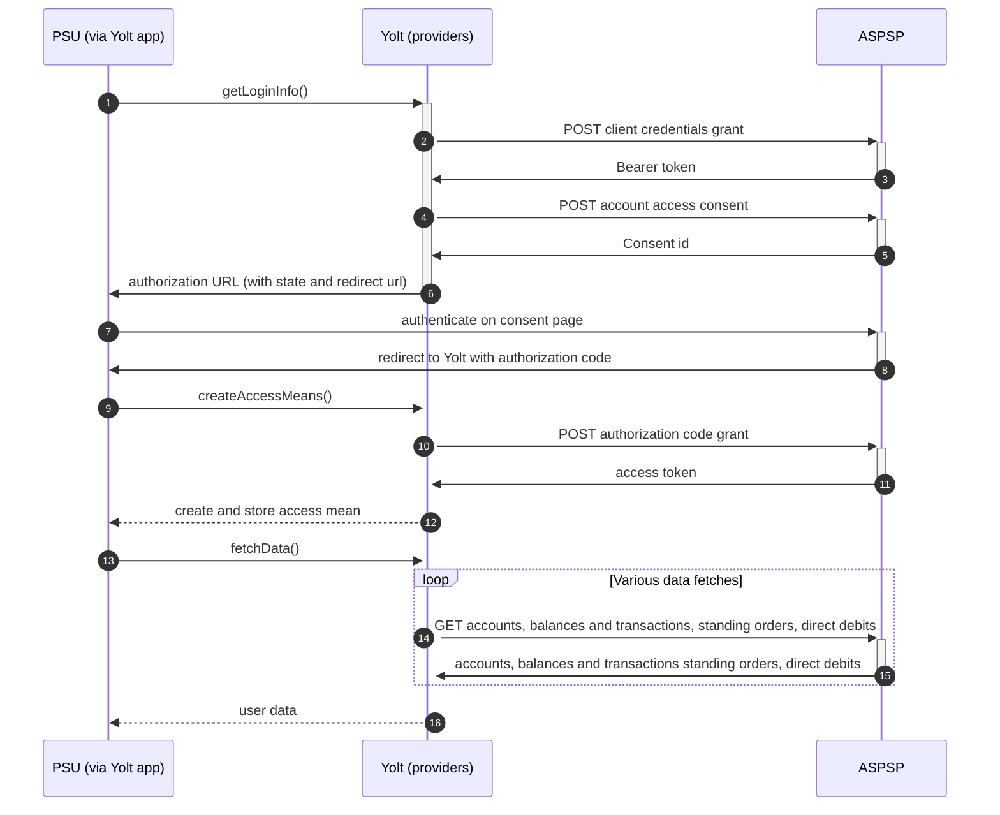

## Virgin Money Credit card (AIS)
[Current open problems on our end][1]

Virgin Money is a financial services brand used by three independent brand-licensees worldwide. Virgin Money branded 
services are currently available in Australia, South Africa and the United Kingdom. Virgin Money branded services were 
formerly offered in the United States.

## BIP overview 

|                                       |                                             |
|---------------------------------------|---------------------------------------------|
| **Country of origin**                 | United Kingdom                              | 
| **Site Id**                           | aff01911-7e22-4b9e-8b86-eae36cf7b732        |
| **Standard**                          | [Open Banking Standard][2]                  |
| **Contact**                           | E-mail: OpenBankingResponse@virginmoney.com |
| **Developer Portal**                  | https://developer.virginmoney.com/          | 
| **Account SubTypes**                  | Current, Savings, Credit Cards              |
| **IP Whitelisting**                   | No                                          |
| **AIS Standard version**              | 1.0.0                                       |
| **Auto-onboarding**                   | Yes                                         |
| **Requires PSU IP address**           | No                                          |
| **Type of certificate**               | OBSEAL, OBWAC certificates required         |
| **Signing algorithms used**           | PS256                                       |
| **Mutual TLS Authentication Support** | Yes                                         |
| **Repository**                        | https://git.yolt.io/providers/open-banking  |

## Links - sandbox

|                         |                                                                                      |
|-------------------------|--------------------------------------------------------------------------------------|
| **Base URL**            | https://sandbox.virginmoney.com/sandbox/openbanking                                  |
| **Authorization URL**   | https://sandbox.virginmoney.com/sandbox/openbanking/oidcapi/oauth2/authorize         | 
| **Token Endpoint**      | https://sandbox.virginmoney.com/sandbox/openbanking/oidcapi/oauth2/token             |
| **Well-known Endpoint** | https://sandbox.virginmoney.com/sandbox/openbanking/.well-known/openid-configuration |  

## Links - production 

|                           |                                                                                                |
|---------------------------|------------------------------------------------------------------------------------------------|
| **Base URL**              | https://secureapi.prod.ob.virginmoney.com/vmpsd2-psd2prod/psd2-production/open-banking         |
| **Authorization URL**     | https://api.prod.ob.virginmoney.com/vmpsd2-psd2prod/psd2-production/oidcapi/oauth2/authorize   | 
| **Token Endpoint**        | https://secureapi.prod.ob.virginmoney.com/vmpsd2-psd2prod/psd2-production/oidcapi/oauth2/token |
| **Registration Endpoint** | https://secureapi.prod.ob.virginmoney.com/vmpsd2-psd2prod/psd2-production/register             |  

## Client configuration overview

|                                   |                                                                         |
|-----------------------------------|-------------------------------------------------------------------------|
| **Client id**                     | Unique identifier received during registration process                  |
| **Client secret**                 | Unique secret received during registration process                      |  
| **Institution id**                | Unique identifier of the financial institution assigned by Open Banking |
| **Software Statement Assertion**  | TPP's Open Banking Software Statement Assertion                         |
| **Software id**                   | TPP's Open Banking software version                                     |
| **Private signing key header id** | OBSEAL certificate id on OB side                                        |
| **Signing key id**                | OBSEAL certificate id on our side (HSM)                                 |
| **Transport key id**              | OBWAC certificate id on our side (HSM)                                  |
| **Transport certificate**         | OBWACK\ transport certificate                                           |

## Registration details

Virgin Money bank requires dynamic registration to be performed before TPP will be able to use their PSD2 API. It can be 
done by proper _/register_ endpoint. During this call we have to use the same values as for future authentication means 
(including certificates) and as a result we receive `clientId` and `clientSecret`, which are required to perform further 
steps. This process was implemented as auto-onboarding mechanism based on [documentation][3] which can be found on
developer portal.
This bank allows using any Open Banking certificate. It means that you don't have to be owner of eIDAS or OBWAC / OBSEAL
certificates. (03.02.2020 - They do not support OBWAC / OBSEAL just OB Legacy)
Using API as audience value bank's base url has to be used, but for registration it has to be the same value as our
institution id. As authorization method supports `client_secret_basic`. Additionally there we are not subscribed to any
particular API version. It means that we have access to all _v3.1_ versions and it depends on bank, which version is
used right now. Thanks that we don't have to remember to switch when new version is released. Business and Retail
accounts can be collected using the same API and one registration.

2021.02.15 - We are using client_secret_basic authentication method. We've failed to use tls_auth. Investigation with
bank has lead to conclusion that we've set "tls_client_auth_dn"claim during registration wrongly. Instead of  
"C=GB,O=YOLT TECHNOLOGY SERVICES LIMITED,2.5.4.97=PSDGB-FCA-921127,CN=0014H00002LmnTjQAJ"  
it should be  "CN=ESgatyXjw1cufl6iZ3AjWE,OU=0014H00002LmnTjQAJ,O=OpenBanking,C=GB" . To use tls we'd have to make
another registration. It was decided we won't do it now.

Since 01.07.2021 OBWAC and OBSEAL certificates are required. OB Legacy certificates can't be used.

## Multiple Registration

We don't know about any registration limits. There was no situation, when such knowledge was needed, so we will have to
ask about that when there will be such case.

## Connection Overview

Virgin Money follows Open Banking standard. It means that flow is similar to other banks. Due to that fact, Open Banking
DTOs are used in implementation, and code relay mostly on our generic Open Banking implementation.

The _getLoginInfo_ method is used to generate login consent for user. First of all we call _token_ endpoint to get Bearer
token. Next _account-access-consents_ endpoint is called to create consent on bank side. Received `consentId` is used to
prepare authorization URL based on _authorize_ endpoint by filling it with necessary parameters. Using this URL, user 
is redirected to login domain to fill his credentials.

In _createAccessMeans_ method `code` is used to call for token. This token will be used to authenticate user
in next calls. In response there is no `refresh_token` returned, but both consent and `access_token` are valid for 90 
days. It means that bank doesn't support refresh flow, so default _refreshAccessMeans_ method is 
overridden and is just throwing `TokenInvalidException` to led user into re-consent flow.

As in other Open Banking banks, Virgin Money also allows for consent removal. It is done by generic code in _onUserSiteDelete_
method. Stored earlier `consentId` is used to perform this operation.

The most complex step is data fetching. The bank allows to collect information about accounts, balances and 
transactions, direct debits and standing orders. The most important thing is that for Credit 
Cards those additional information are not collected.

The consent window is not implemented.
**Consent validity rules** are implemented for Virgin Money AIS.

Important information is that this bank support pagination for transactions. It returns both `BOOKED` and
`PENDING` transactions.

Simplified sequence diagram:

   
## Sandbox overview

The Sandbox contains mock data for the purpose of testing API connectivity. The Sandbox interface and authentication 
flows are created to represent the production environment to allow users to progress the development and testing of 
application.
Everyone can access the sandbox using predefined mock users. Credentials can be found [here][4]. The sandbox wasn't used 
during implementation process, so we don't have any further information about it. 

## User Site deletion
There's `onUserSiteDelete` method implemented by this provider, however, only in a best effort manner.

## Business and technical decisions

During implementation we made following business decisions:

Virgin Money supports only `INTERIMBOOKED` and `INTERIMAVAILABLE` balances. First one is mapped for Current balance, second 
one for Available balance. For Credit Cards if only `INTERIMAVAILABLE` will be present, this value will be used as Current
balance. Logic for mapping Available balance for Credit cards is more complicated. It can be _null_ or calculated using
credit line.

During implementation we found that on _/delete_ endpoint `Accept` header can't be used. We are cutting it using custom
interceptor. https://yolt.atlassian.net/browse/C4PO-4292

Important information is that this bank isn't implemented as a group of banks. It is due to the fact that we made a
mistake
during implementation. To reduce time for refactoring we decided to leave it as it is, because Virgin Money is a single
bank, not a group.

According to the branding book attached here: https://yolt.atlassian.net/browse/C4PO-8077 - we needed to rename
this old VM connection to 'Virgin Money Credit card' and change its icon to the appropriate one.

C4PO-9893 SCA exemption. We will receive a Refresh Token when calling for an Access Token using grant_type::
authorization_code which can be used each time you call for a new Access Token using grant_type::refresh_token. You will
not receive a new refresh token each time you call for an Access Token when using grant_type::refresh_token.
This change will be live at 30.09.2022.

## External links

* [Current open problems on our end][1]
* [Open Banking Standard][2]

[1]: <https://yolt.atlassian.net/issues/?jql=project%20%3D%20%22C4PO%22%20AND%20component%20%3D%20VIRGIN_MONEY%20AND%20status%20!%3D%20Done%20AND%20Resolution%20%3D%20Unresolved%20ORDER%20BY%20status>

[2]: <https://standards.openbanking.org.uk/>

[3]: <https://developer.virginmoney.com/product>

[4]: <https://developer.virginmoney.com/faq#n139>
