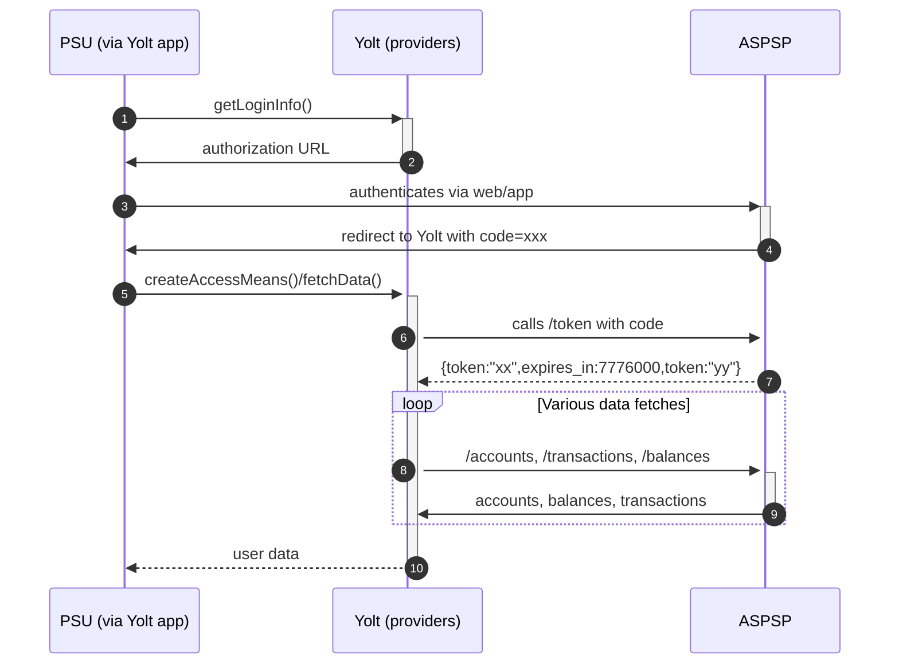

## BNP Paribas Fortis (AIS)
[Current open problems on our end][1]

BNP Paribas Fortis is an international bank based in Belgium and is a subsidiary of BNP Paribas. 
BNP Paribas Fortis is the largest bank in Belgium. 
It offers a full range of financial services to private and corporate clients, wealthy individuals, companies, public and financial institutions. 
The activities are divided into four business lines: Retail & Private Banking, Corporate & Public Banking, Corporate & Investment Banking and Investment Solutions.

## BIP overview
|                                                 |                                                  |
|-------------------------------------------------|--------------------------------------------------|
| **Country of origin**                           | Belgium                                          | 
| **Site Id**                                     | cf0de92e-ae71-4a68-af08-237f96206cea             |
| **Standard**                                    | [STET Standard][2]                               |
| **General Support Contact**                     | Email : openbanking@bnpparibasfortis.com         |
| **Other's Contact**                             | Developer portal [support module][8]             |
| **Skype Contact**                               | None                                             |
| **AIS Standard version**                        | 2.0.2                                            |
| **PISP Standard version**                       | 2.0.2 (not implemented in providers)             |
| **Mutual TLS Authentication support**           | Yes                                              |
| **Signing algorithm used for register request** | RS256                                            |
| **Signing algorithms used**                     | PS256                                            |
| **Account types**                               | Current                                          |
| **Requires PSU IP address**                     | No                                               |
| **Auto Onboarding**                             | Implemented                                      |
| **IP Whitelisting**                             | Bank is not supporting Whitelisting              |
| **Type of needed certificate**                  | Eidas certificates are required : QWAC and QSEAL |
| **Repository**                                  | https://git.yolt.io/providers/stet               |

## Links - development
|                          |                                                             |
|--------------------------|-------------------------------------------------------------|
| **Developer portal**     | https://developer.bnpparibasfortis.com                      |
| **Sandbox baseUrl**      | https://sandbox.api.bnpparibasfortis.com                    |
| **Sandbox registration** | https://sandbox.middleware.bnpparibasfortis.com/third-party |

## Links - production
|                              |                                                                                                                                                                                           |
|------------------------------|-------------------------------------------------------------------------------------------------------------------------------------------------------------------------------------------|
| **Production base url**      | https://regulatory.api.bnpparibasfortis.be                                                                                                                                                |
| **Production registration**  | https://regulatory.api.bnpparibasfortis.be/third-party-onboarding/v1/third-party                                                                                                          |
| **Production authorization** | https://services.bnpparibasfortis.be/SEPLJ04/sps/oauth/oauth20/authorize?client_id={TPP_CLIENT_ID}&scope={TPP_SCOPE}&response_type=code&state={TPP_STATE}&redirect_uri={TPP_REDIRECT_URL} |

## Client configuration overview
|                           |                                                                                  |
|---------------------------|----------------------------------------------------------------------------------|
| **Client name**           | Name of the application to be created by the TPP                                 | 
| **Client description**    | Description of the client/application of the TPP                                 | 
| **Client website uri**    | Domain name of registered client/application                                     |
| **Contact first name**    | The first name of the contact person linked to the client/application of the TPP |
| **Contact last name**     | The last name of the contact person linked to the client/application of the TPP  |
| **Contact email**         | The email of the contact person linked to the client/application of the TPP      |
| **Transport certificate** | Eidas transport certificate                                                      |
| **Transport key id**      | Eidas transport key id                                                           |      
| **Signing certificate**   | Eidas signing certificate                                                        | 
| **Signing key id**        | Eidas signing key id                                                             | 
| **Client secret**         | Client secret value generated during auto onboarding process                     | 
| **Client id**             | Client id value generated during auto onboarding process                         | 

## Registration details
This bank requires dynamic registration.

You have to use proper endpoint https://regulatory.api.bnpparibasfortis.be/third-party-onboarding/v1/third-party to perform POST request. 
During this process your QWAC certificate will be uploaded on bank side. As a result bank returns client id and client secret values. 
Due to that fact auto onboarding was implemented.

During registration you can register more that one redirect urls.

In Production you will only be authorized to onboard one client application with one QWAC certificate. 
This also means that in Production you have to do the onboarding once for all the brands.

### Delete registration
Deletion of registration was not recognized, therefore no REST communication with the bank in order to delete the registration. 
Please note that the current request to delete the registration will be performed by deleting it only on our side.

### Certificate rotation
If we need to upload a new certificate to replace another that was previously uploaded (because the previous one expired) 
bank's admin will need to remove the old certificate.

We can send them an email or support request and ask them to revoke the certificate. 
The certificate needs to be revoked manually so this might take a bit of time. 
Once it is revoked we will receive notification that the certificate was deleted, then we can onboard again. 
We will have to delete the app that was created by the first onboarding as well, however. 
We can then upload your new certificate to our API client, and call the onboarding endpoint again.

## Connection Overview
The swagger provided by the bank was broken (one broken field) so corrected versions is commited under [swagger-version-2.0.1.json][6].
Documentation for the bank can be found on their developer portal [https://developer.bnpparibasfortis.com/docs][7]. 
To access data you have to login using credentials and special SMS code.

The bank uses [http cavage signatures][3] for signing the requests, which uses the
following fields in this order '(request-target) (created) (expires) host x-request-id digest.
What is more, bank requires `/psd2/v2/accounts` as path value for signature generation. Due to that fact default
implementation was extended for fetch data logic.

The provider uses [RFC 7616][4] for calculating the digest with SHA-256 algorithm.

The bank uses dateTo and dateFrom parameters to collect transactions. 
Those parameters are optional, but in that situation only transactions from last 6 months will be returned.

During authorization step, refresh token is returned, but based on documentation their access_token is valid for 90 days. 
That's we we don't implement refresh token flow. After that time user will be asked to perform consent step.

Simplified sequence diagram:

## User Site deletion
This provider does NOT implement `onUserSiteDelete` method.

## Business decisions
BNP Paribas Fortis returns (source: RDD for a single user) two balance types (CLBD, OTHR). 
OTHR includes pending transactions and standing orders.
A fallback is made to map balances based on priority list of four balances enumerated in documentation (namely: CLBD, VALU, XPCD, OTHR). 
As a result we prefer to map CLBD as current balance and OTHR as available balance.

Bank returns also five types of transactions (BOOK, PDNG, RJCT, FUTR, OTHR). 
Due to the fact that there are not enough internal types in yolt we decided to map only BOOK and PDNG transactions. 
That's why dateTo parameter during fetch data step is set for time of the request.

We decided to use transactionDate field as our internal transaction dateTime value. 
As this is optional value on bank side there is fallback for bookingDate created, which is mandatory field.

Based on our experience with other STET banks we decided to add PSU-IP-Address header to our fetch data requests.

By the business decision, we decided to skip RJCT transactions mapping until there's no proper transactions status in our model for this case.

C4PO-9794
We decided to filter pending transactions, because we had an issue with empty bookingDate.
And these transactions are filtered later by core team.
## Sandbox overview
Sandbox wasn't used during barebonses implementation. There are instructions how to register for sandbox in documentation. 
Sandbox also required auto onboarding with additional Authorization header (value has to be collected from portal). 
It allows for more that one registration on one certificates.

## External links
* [Current open problems on our end][1]
* [STET Standard][2]
* [http cavage signatures][3]
* [RFC 7616][4]
* [Developer portal][6]

[1]: <https://yolt.atlassian.net/issues/?jql=project%20%3D%20%22C4PO%22%20AND%20component%20%3D%20%22BNP%20Paribas%20Fortis%22%20AND%20status%20!%3D%20Done%20AND%20Resolution%20%3D%20Unresolved%20ORDER%20BY%20status>
[2]: <https://www.stet.eu/en/psd2/>
[3]: <https://www.ietf.org/archive/id/draft-cavage-http-signatures-12.txt>
[4]: <https://tools.ietf.org/html/rfc7616>
[5]: <https://developer.bnpparibasfortis.com/docs>
[6]: ./swagger/swagger-version-2.0.2.json
[7]: <https://developer.bnpparibasfortis.com/docs>
[8]: <https://developer.bnpparibasfortis.com/notification>
