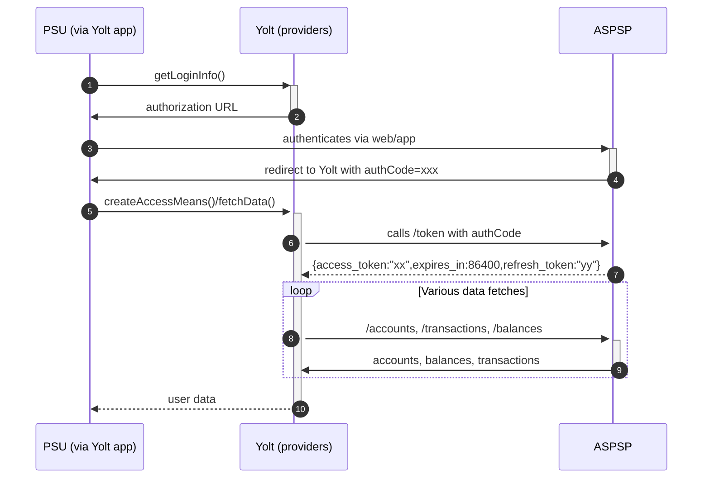

## Boursorama (AIS)
[Current open problems on our end][1]

Boursorama is a french bank with its shares held by Societe Generale Group focused on online banking and broking. 
Approximate number of users in 2019 reached 2 mln.

## BIP overview 
[Main reference BIP][2]

|                                       |                                                                     |
|---------------------------------------|---------------------------------------------------------------------|
| **Country of origin**                 | France                                                              | 
| **Site Id**                           | 2121d5c2-811b-4b7a-a12b-8f83dc9804fa                                |
| **Standard**                          | [STET Standard][3]                                                  |
| **Form of Contact**                   | Email - contact.dsp2@boursorama.fr / [Ticketing system][11]         |
| **Base URL**                          | **Sandbox** - [Sandbox URL][4] **Production** - [Production URL][5] |
| **Signing algorithms used**           | SHA 256 with RSA                                                    |
| **Mutual TLS Authentication Support** | Yes                                                                 |
| **IP Whitelisting**                   | No                                                                  |
| **Auto-onboarding**                   | No support                                                          |
| **AIS Standard version**              | 1.4.2                                                               |
| **Account types**                     | CURRENT_ACCOUNT                                                     |
| **Requires PSU IP address**           | No                                                                  |
| **Repository**                        | https://git.yolt.io/providers/stet                                  |

## Links - production 
|                   |                                                  |
|-------------------|--------------------------------------------------|
| **Login domains** | [clients.boursorama.com](clients.boursorama.com) | 

## Links - sandbox 
|                   |                                                                    |
|-------------------|--------------------------------------------------------------------|
| **Login domains** | [api-dsp2-sandbox.boursorama.com](api-dsp2-sandbox.boursorama.com) | 

## Client configuration overview
|                                  |                                                                 |
|----------------------------------|-----------------------------------------------------------------|
| **Signing key id**               | Eidas signing key id                                            | 
| **Signing certificate**          | Eidas signing certificate                                       | 
| **Transport key id**             | Eidas transport key id                                          |
| **Transport certificate**        | Eidas transport certificate                                     |
| **Certificate Agreement Number** | value obtainable from our Eidas certificate, extensions         |
| **Client id**                    | Equal to certificate agreement number if we do not use aliasing | 

## Registration details
This bank does not require any registration. It has a special form of multitenancy called client aliasing. If a TPP wants to share 
it's data to different parties (work as a proxying party like Yolt or Token.io). This might be useful when handling unlicensed tenant parties.
*A decision was made that we do not use this mechanism, as it is quite unique.* 

### Delete registration
Due to not required any registration the current request to delete the registration will be performed by deleting it only on our side.

### Multiple Registration
Bank only supports one certificate per registration, but we can have multiple “aliases” for one certificate (dsp2/oauth/client)

### Certificate rotation
As the bank does not require any certification and there is no auto onboarding in place we can simply start using new certificate.

## Connection Overview
The bank uses [http cavage signatures][4] for signing the requests, which uses the
following fields in this order '(request-target)',  'Digest' and  'X-Request-Id'. 
The provider uses [RFC 7616][5] for calculating the digest with SHA-256 algorithm.
The bank uses the extended scope for transactions. This means that only the first access_token can be used to access data from before 90 days in the past.

Updated information about connection details is posted on [Developer portal][8].

The swagger provided by the bank is broken and the original and corrected versions are committed under [Original ais swagger schema][9] and [Corrected ais swagger schema][10] respectively. 
The connection does not have any sensible nor reasonable documentation and it follows mostly generic STET flow, but there are few differences:
* There is no pagination
* The login url has two redirects (one for happy flow, one for errors, but according to the e-mails from them it can be set to the same value)

Simplified sequence diagram:

**Consent validity rules**

Consent validity rules has been implemented for Boursorama AIS.

## Business and technical decisions
Boursorama returns just one balance type (EXPECTED). A business decision was made with Leon to map this value to both available and current balances. 

Boursorama offers deferred debit cards. In Boursorama app/website transactions made with this kind of cards are visible as
pending and are booked once in a month. When requesting account through api, Boursorama returns additional account for deferred debit card (which in fact is a subaccount). This subaccount has cashAccountType: CARD,
and linkedAccount: resource id of main account. This subaccount has details about all transactions made by deferred debit card. In the main account only one
transaction is visible and has remittance information filed with 'Relevé différé Carte'. Deferred transactions have impact for
balances only when status will change to booked.

* 04.05.2021: According to C4PO-8183 we should treat deferred credit card account as a credit card account
* 12.05.2021: According to C4PO-8183 we map 'OTHR' balance type as current for credit card account
* 18.05.2021: According to C4PO-8183 we map 'OTHR' transaction status as pending
* 29.06.2021: **refresh-access-means's** signing is faulty implemented, however, it works properly on all environments, thus the decision not to "fix" this.

* C4PO-9794
We decided to turn on filtering other than Booking and Other transactions

## Sandbox overview
The sandbox API is available on the domain [Sandbox URL][4]. It works the same as the production API, with the exceptions pointed on developer site.
The responses coming from the bank have slight differences, that can lead into the trap due to lack of documentation. 
For example the headers sent are different on sandbox than on production. 

## User Site deletion
This provider does NOT implement `onUserSiteDelete` method.

## External links
* [Current open problems on our end][1]
* [Main reference BIP][2]
* [STET Standard][3]
* [Sandbox URL][4]
* [Production URL][5]
* [http cavage signatures][6]
* [RFC 7616][7]
* [Developer portal][8]
* [Original ais swagger schema][9]
* [Corrected ais swagger schema][10]
 
[1]: <https://yolt.atlassian.net/issues/?jql=project%20%3D%20%22C4PO%22%20AND%20component%20%3D%20Boursorama%20AND%20status%20!%3D%20Done%20AND%20Resolution%20%3D%20Unresolved%20ORDER%20BY%20status>
[2]: <https://yolt.atlassian.net/wiki/spaces/LOV/pages/3907779/BIP+Boursorama>
[3]: <https://www.stet.eu/en/psd2/>
[4]: <https://api-dsp2-sandbox.boursorama.com>
[5]: <https://api-dsp2.boursorama.com>
[6]: <https://tools.ietf.org/html/draft-cavage-http-signatures-08>
[7]: <https://tools.ietf.org/html/rfc7616>
[8]: <https://developer.boursorama.com/dsp2>
[9]: ./swagger/boursorama/schema.dsp2.v1.7_original.json
[10]: ./swagger/boursorama/schema.dsp2.v1.7.json
[11]: <https://developer.boursorama.com/dsp2/issues>