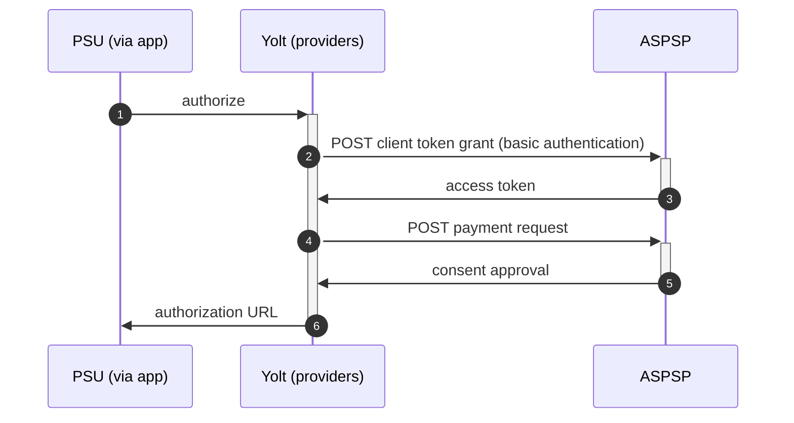

## Boursorama (PIS)
[Current open problems on our end][1]

Boursorama is a french bank with its shares held by Societe Generale Group focused on online banking and broking. 
Approximate number of users in 2019 reached 2 mln.

## BIP overview 
[Main reference BIP][2]

|                                       |                                                                     |
|---------------------------------------|---------------------------------------------------------------------|
| **Country of origin**                 | France                                                              | 
| **Site Id**                           | 2121d5c2-811b-4b7a-a12b-8f83dc9804fa                                |
| **Standard**                          | [STET Standard][3]                                                  |
| **Form of Contact**                   | Email - contact.dsp2@boursorama.fr / [Ticketing system][11]         |
| **Base URL**                          | **Sandbox** - [Sandbox URL][4] **Production** - [Production URL][5] |
| **Signing algorithms used**           | SHA 256 with RSA                                                    |
| **Mutual TLS Authentication Support** | Yes                                                                 |
| **IP Whitelisting**                   | No                                                                  |
| **Auto-onboarding**                   | No support                                                          |
| **PISP Standard version**             | 1.4.1                                                               |
| **Requires PSU IP address**           | No                                                                  |
| **Repository**                        | https://git.yolt.io/providers/stet                                  |

## Links - production 
|                   |                                                  |
|-------------------|--------------------------------------------------|
| **Login domains** | [clients.boursorama.com](clients.boursorama.com) | 

## Links - sandbox 
|                   |                                                                    |
|-------------------|--------------------------------------------------------------------|
| **Login domains** | [api-dsp2-sandbox.boursorama.com](api-dsp2-sandbox.boursorama.com) | 

## Client configuration overview
|                                  |                                                                 |
|----------------------------------|-----------------------------------------------------------------|
| **Signing key id**               | Eidas signing key id                                            | 
| **Signing certificate**          | Eidas signing certificate                                       | 
| **Transport key id**             | Eidas transport key id                                          |
| **Transport certificate**        | Eidas transport certificate                                     |
| **Certificate Agreement Number** | value obtainable from our Eidas certificate, extensions         |
| **Client id**                    | Equal to certificate agreement number if we do not use aliasing | 

### Registration details
Registration from AIS is used

## Multiple Registration
Refer AIS ReadMe

### Certificate rotation
Refer AIS ReadMe

## Connection Overview
The bank uses [http cavage signatures][6] for signing the requests, which uses the
following fields in this order '(request-target)',  'Digest' and  'X-Request-Id'. 
The provider uses [RFC 7616][7] for calculating the digest with SHA-256 algorithm.
The bank uses the extended scope for transactions. This means that only the first access_token can be used to access data from before 90 days in the past.

Updated information about connection details is posted on [Developer portal][8].

Implementing PIS flow the swagger provided previously that was used in AIS implementation phase contained missing and corrupted data, therefore a newest one was downloaded [Original pis swagger schema][9].
Unfortunately this one also had to be corrected [Corrected pis swagger schema][10]. 

The payment request sends to bank should not contains any null object, therefore based upon original payment request object 
the custom PaymentRequestResource DTO was created.

According to the bank requirements the dateTime format used in PIS flow is vey explicit and is exposed in PaymentRequestResource class.

Boursorama only implements « REDIRECT » authentication approach as a method used in acceptedAuthenticationApproach.

Simplified sequence diagram:

**Consent validity rules**

Consent validity rules has been implemented for Boursorama PIS.

## Business and technical decisions
The different swagger file (then ais) was used to generate pis model classes, because the file was updated by Bank
and could causes issues with backward compatibility. Especially since it was damaged.

Swagger shows that 'create payment' and 'submit payment' steps are 
merged. Bank responded that the PSU confirms the request on redirect Url  (https://clients.boursorama.com/finalisation-virement/resourceId) returned by POST payment-requests api.
Then the payment is confirmed. Therefore 'submit payment' was implemented in way of using 'getStatus' step.

## Sandbox overview
The sandbox API is available on the domain [Sandbox URL][4]. It works the same as the production API, with the exceptions pointed on developer site.
During PIS implementation no sandbox tests was performed.
  
## External links
* [Current open problems on our end][1]
* [Main reference BIP][2]
* [STET Standard][3]
* [Sandbox URL][4]
* [Production URL][5]
* [http cavage signatures][6]
* [RFC 7616][7]
* [Developer portal][8]
* [Original pis swagger schema][9]
* [Corrected pis swagger schema][10]

[1]: <https://yolt.atlassian.net/issues/?jql=project%20%3D%20%22C4PO%22%20AND%20component%20%3D%20Boursorama%20AND%20status%20!%3D%20Done%20AND%20Resolution%20%3D%20Unresolved%20ORDER%20BY%20status>
[2]: <https://yolt.atlassian.net/wiki/spaces/LOV/pages/3907779/BIP+Boursorama>
[3]: <https://www.stet.eu/en/psd2/>
[4]: <https://api-dsp2-sandbox.boursorama.com>
[5]: <https://api-dsp2.boursorama.com>
[6]: <https://tools.ietf.org/html/draft-cavage-http-signatures-08>
[7]: <https://tools.ietf.org/html/rfc7616>
[8]: <https://developer.boursorama.com/dsp2>
[9]: ./swagger/boursorama/schema.dsp2.pis.v1.7_original.json
[10]: ./swagger/boursorama/schema.dsp2.pis.v1.7.json
[11]: <https://developer.boursorama.com/dsp2/issues>