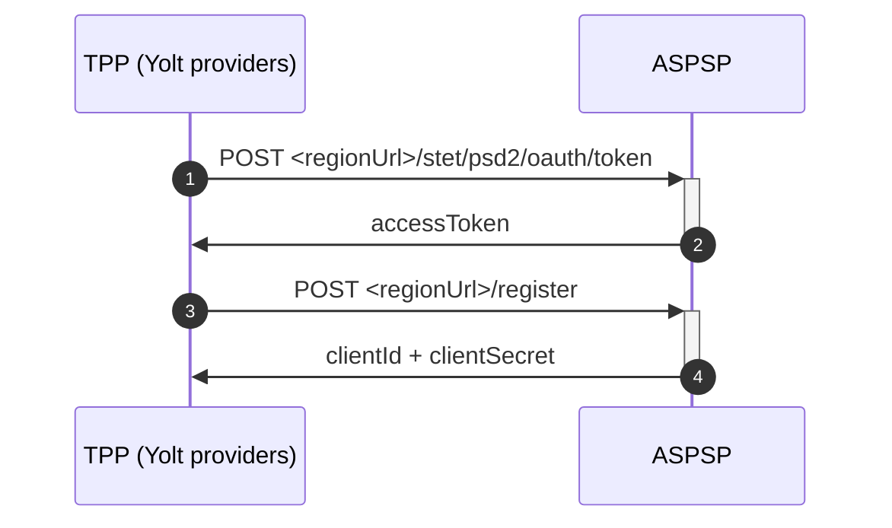

## Banque Populaire (AIS)
[Current open problems on our end][1]

## BIP overview 

|                                       |                                                                         |
|---------------------------------------|-------------------------------------------------------------------------|
| **Country of origin**                 | France                                                                  | 
| **Site Id**                           | 1d223488-a172-11e9-a2a3-2a2ae2dbcce4                                    |
| **Standard**                          | STET                                                                    |
| **Contact**                           | E-mail: 89c3_api_support@i-bp.fr  Service Desk Portal :  Contact Form : |
| **Developer Portal**                  | https://www.api.89c3.com/en/                                            | 
| **Account SubTypes**                  | current                                                                 |
| **IP Whitelisting**                   |                                                                         |
| **AIS Standard version**              | STET 1.4.2                                                              |
| **PISP Standard version**             |                                                                         |
| **Auto-onboarding**                   | YES* (see registration details section)                                 |
| **Requires PSU IP address**           | yes                                                                     |
| **Type of certificate**               | eidas                                                                   |
| **Signing algorithms used**           | rsa-sha256                                                              |
| **Mutual TLS Authentication Support** |                                                                         |
| **Repository**                        | https://git.yolt.io/providers/stet                                      |

## Links - sandbox
Example fields (for each bank fields might be different)

|                            |     |
|----------------------------|-----|
| **Base URL**               |     | 
| **Authorization Endpoint** |     |
| **Token endpoint**         |     |

## Links - production 
|                   |                                                                                                                                                                                                                                                                                                                                                                                                                                                                          |
|-------------------|--------------------------------------------------------------------------------------------------------------------------------------------------------------------------------------------------------------------------------------------------------------------------------------------------------------------------------------------------------------------------------------------------------------------------------------------------------------------------|
| **Login domains** | www.10807.live.api.89c3.com   www.16807.live.api.89c3.com   www.10207.live.api.89c3.com   www.18707.live.api.89c3.com   www.13507.live.api.89c3.com   www.16607.live.api.89c3.com   www.10907.live.api.89c3.com   www.10907.live.api.89c3.com   www.14707.live.api.89c3.com   www.17807.live.api.89c3.com   www.13807.live.api.89c3.com   www.13807.live.api.89c3.com   www.14607.live.api.89c3.com   www.10548.live.api.89c3.com | 

## Client configuration overview

|                           |                                                       |
|---------------------------|-------------------------------------------------------|
| **Signing key id**        | Signing key id                                        | 
| **Signing certificate**   | Signing certificate (eidas)                           | 
| **Transport key id**      | Transport key id                                      |
| **Transport certificate** | Transport certiificate (eidas)                        |
| **Client Id**             | Client Id obtained from dynamic registration          |
| **Client Email**          | Contact e-mail sent to bank                           | 
| **Client Name**           | Client application name (shown on authorization page) | 

## Registration details

BPCE Group used to support manual registration. Unfortunately the manual registration on portal apparently is not working anymore. 
We've implemented dynamic registration for this group as they have made recently an API that supports it. The flow according to documentation is a bit different from other STET flows as it requires bearer token. It looks as follows: 

Take into account there are limitations and the registration does not propagate immediately.
It will be automatically taken into account the next working day @02:00 pm continental time (or on the very same day if the 09:59 am deadline is not reached).

Certificate rotation is done via the update registration flow, and it was implemented here and tested by changing the contact e-mail. There is one pending issue with the whole thing. Registration's done in old manual way has to be reregistered. This can be an issue for CASY.
The registration's also among the BPCE Group are shared because you cannot have the same client_name for two registrations, and this is something that is displayed for the PSU.

## Connection Overview

**Consent validity rules**
Consent validity rules are implemented for PIS.
Bank AIS uses dynamic flow, thus we are unable to determine consent validity rules for AIS.

## Sandbox overview
  
## Business and technical decisions
According to the documentation of the bank it supports only CACC as "payment" accounts which we map to current account.

For'VALU' balance type represents current balance, so the following changes needed to be made:
1. 'VALU' balance type is now mapped to 'CLOSING_CLEARED' balance type.
2. CurrentBalance is provided by 'CLOSING_CLEARED' balance.
3. AvailableBalance is provided by CLOSING_BOOKED balance.     

C4PO-9794
We decided to filter pending and othr transactions, because we had an issue with empty bookingDate.
And these transactions are filtered later by core team.
**Payment Flow Additional Information**

|                                                                                                        |                             |
|--------------------------------------------------------------------------------------------------------|-----------------------------|
| **When exactly is the payment executed ( executed-on-submit/executed-on-consent)?**                    | execute-on-submit           |
| **it is possible to initiate a payment having no debtor account**                                      | YES                         |
| **At which payment status we can be sure that the money was transferred from the debtor to creditor?** | AcceptedSettlementCompleted |

## External links
* [Current open problems on our end][1]

[1]: <https://yolt.atlassian.net/issues/?jql=project%20%3D%20%22C4PO%22%20AND%20component%20%3D%20%22%20Banque%20Populaire%22%20AND%20status%20!%3D%20Done%20AND%20Resolution%20%3D%20Unresolved%20ORDER%20BY%20status>
