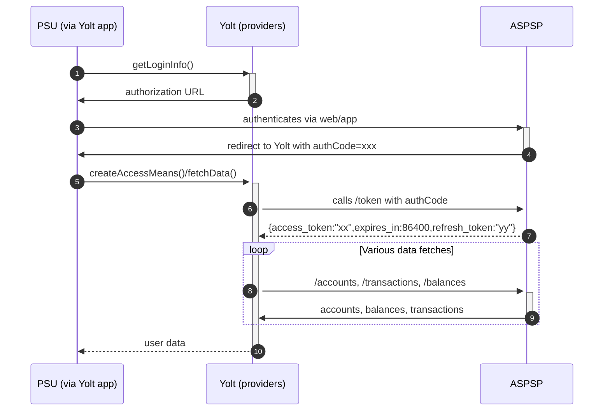

## Banque Laydernier (AIS)

[Current open problems on our end][1]

Banque Laydernier is a French bank created in 1891.

## BIP overview

|                                       |                                                                |
|---------------------------------------|----------------------------------------------------------------|
| **Country of origin**                 | France                                                         | 
| **Site Id**                           | 8b5afafe-e05a-450e-8f7c-ec8acb30d23b                           |
| **Standard**                          | [Standard][2]                                                  |
| **Contact**                           | Ticketing system: https://developer.groupe-credit-du-nord.com/ |
| **Developer Portal**                  | https://developer.groupe-credit-du-nord.com/                   | 
| **Account SubTypes**                  | Current, Credit Cards                                          |
| **IP Whitelisting**                   | No                                                             |
| **AIS Standard version**              | 1.4.2.17.10                                                    |
| **Auto-onboarding**                   | No                                                             |
| **Requires PSU IP address**           | Yes                                                            |
| **Type of certificate**               | eIDAS                                                          |
| **Signing algorithms used**           | RS256                                                          |
| **Mutual TLS Authentication Support** | Yes                                                            |
| **Repository**                        | https://git.yolt.io/providers/stet                             |

## Links - sandbox

|                       |                                                                              |
|-----------------------|------------------------------------------------------------------------------|
| **Base URL**          | https://mtls.api.sb.groupe-credit-du-nord.com                                |
| **Authorization URL** | https://laydernier.cdn-connect.sb.groupe-credit-du-nord.com/oauth2/authorize | 
| **Token Endpoint**    | https://mtls.cdn-connect.sb.groupe-credit-du-nord.com/oauth2/token           |  

## Links - production

|                           |                                                                           |
|---------------------------|---------------------------------------------------------------------------|
| **Base URL**              | https://mtls.api.groupe-credit-du-nord.com/cdn/prod/v1.4.2.17.1/psd2/aisp |
| **Authorization URL**     | https://laydernier.cdn-connect.groupe-credit-du-nord.com/oauth2/authorize | 
| **Token Endpoint**        | https://mtls.cdn-connect.groupe-credit-du-nord.com/oauth2/token           |  
| **Registration Endpoint** | n/a                                                                       |  

## Client configuration overview

|                           |                                 |
|---------------------------|---------------------------------|
| **Transport key id**      | eIDAS transport key id          |
| **Transport certificate** | eIDAS qWAC                      |
| **Signing key id**        | Signing key id                  | 
| **Signing certificate**   | eIDAS QSeal                     | 
| **Client id**             | Created in the developer portal |
| **Client secret**         | Created in the developer portal |

## Registration details

One registers in the developer portal

## Multiple Registration

This section has to be filled with information about multiple registrations. Probably during bank implementation we
don't have such information. We suspect that this will be updated when migration will be done.

## Connection Overview

Simplified sequence diagram:

## Sandbox overview

Sandbox was skipped because it was decided to attach this bank to an existing group

## Consent validity rules

TBA

## User Site deletion

User site deletion is not implemented

## Business and technical decisions

## External links

* [Current open problems on our end][1]
* [Standard][2]

[1]: <https://yolt.atlassian.net/issues/?jql=project%20%3D%20%22C4PO%22%20AND%20component%20%3D%20BANQUE_LAYDERNIER%20AND%20status%20!%3D%20Done%20AND%20Resolution%20%3D%20Unresolved%20ORDER%20BY%20status>

[2]: <https://www.stet.eu//>