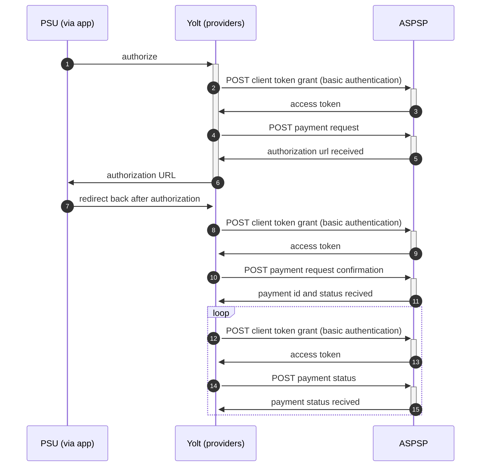

## Société Générale Particuliers (PIS)

* [API guidelines](https://developer.societegenerale.fr/en/api-guideline)
* [Products](https://developer.societegenerale.fr/en/product)

|                                       |                                      |
|---------------------------------------|--------------------------------------|
| **Country of origin**                 | France                               | 
| **Site Id**                           | 654bcfc0-a173-11e9-a2a3-2a2ae2dbcce4 |
| **Standard**                          | [STET Standard][2]                   |
| **Developer portla**                  | [Developel portla][3]                | 
| **Form of Contact**                   | [Ticketing system][4]                |
| **Signing algorithms used**           | SHA 256 with RSA                     |
| **Mutual TLS Authentication Support** | Yes                                  |
| **IP Whitelisting**                   | No                                   |
| **Auto-onboarding**                   | No support                           |
| **PISP Standard version**             | 1.4.2.15                             |
| **Requires PSU IP address**           | No                                   |
| **Repository**                        | https://git.yolt.io/providers/stet   |

## Links - production

|              |                                                                     |
|--------------|---------------------------------------------------------------------|
| **BaseUrl**  | https://mtls.api.societegenerale.fr/sg/prod/dsp2/pisp/pri/v1.4.2.15 |
| **TokenUrl** | https://mtls.sg-signin.societegenerale.fr/oauth2/token              |

## Links - sandbox

|              |                                                                      |
|--------------|----------------------------------------------------------------------|
| **BaseUrl**  | https://mtls.api.sb.societegenerale.fr/sg/sb/dsp2/pisp/pri/v1.4.2.15 |
| **TokenUrl** | https://mtls.sg-signin.sb.societegenerale.fr/oauth2/token            |

## Client configuration overview

|                           |                                                                         |
|---------------------------|-------------------------------------------------------------------------|
| **Signing key id**        | Eidas signing key id                                                    | 
| **Signing certificate**   | Eidas signing certificate                                               | 
| **Transport key id**      | Eidas transport key id                                                  |
| **Transport certificate** | Eidas transport certificate                                             |
| **Client secret**         | Secret provided by Societe Generale from their developer portal         |
| **Client id**             | Identification provided by Societe Generale from their developer portal | 

## Connection Overview

The bank uses [http cavage signatures][4] for signing the requests, which uses the following fields in this order '(
request-target)',  'Digest' and  'X-Request-Id'. The provider uses [RFC 7616][5] for calculating the digest with SHA-256
algorithm. The bank uses the extended scope for transactions. This means that only the first access_token can be used to
access data from before 90 days in the past.

Societe Generale only implements « REDIRECT » authentication approach as a method used in
acceptedAuthenticationApproach.

Simplified sequence diagram:

**Consent validity rules**

Consent validity rules are not implemented for Societe Generale PIS as for all payment providers

## Business and technical decisions

## Sandbox overview

During PIS implementation no sandbox tests was performed.

## External links

* [Current open problems on our end][1]]
* [STET Standard][2]
* [Developer Portal][3]
* [Ticketing system][4]
* [http cavage signatures][5]
* [RFC 7616][6]

[1]: <https://yolt.atlassian.net/browse/C4PO-9862?jql=project%20%3D%20%22C4PO%22%20AND%20component%20%3D%20%22Societe%20Generale%22%20AND%20status%20!%3D%20Done%20AND%20Resolution%20%3D%20Unresolved%20ORDER%20BY%20status>

[2]: <https://www.stet.eu/en/psd2/>

[3]: <https://developer.societegenerale.fr/>

[4]: <https://developer.societegenerale.fr/en/live/co/yolt/issues>

[5]: <https://datatracker.ietf.org/doc/draft-cavage-http-signatures/>

[6]: <https://tools.ietf.org/html/rfc7616>
